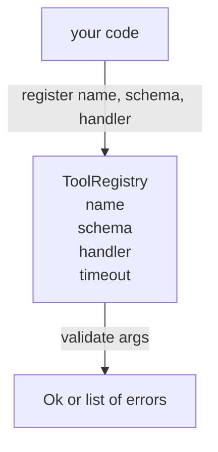

# Tool Registry with Schema Validation

> الأداة التي لا يستطيع الوكيل التحقق من صحتها هي أداة لا يستطيع الوكيل الاتصال بها. قم بإنشاء السجل ومدقق المخطط قبل إنشاء الأدوات.

**النوع:** بناء
** اللغات: ** بايثون
**المتطلبات الأساسية:** المرحلة 13 دروس 01-07، المرحلة 14 الدرس 01
**الوقت:** ~90 دقيقة

## Learning Objectives
- Hold a typed registry of tool name → schema → handler that the dispatcher can ask once and trust afterwards.
- Implement a JSON Schema 2020-12 subset that covers the keywords ninety percent of tool calls actually use.
- Return precise, json-pointer-shaped error paths so the model can self-correct in one round trip.
- Reject re-registration without explicit override, since silent overwrites are how production tool catalogs drift.
- Keep the validator pure (no I/O, no time, no globals) so it can be re-run on a replay log.

## Why the registry comes before the tool

يحتوي وكيل الترميز في عام 2026 على أدوات مسجلة أكثر مما يمكن للنموذج احتواؤه في نافذة سياق واحدة. سوف يسجل الحزام غير التافه مائتي أداة ويسطح من عشرة إلى أربعين في أي دورة معينة. السجل هو مصدر الحقيقة فيما يتعلق بـ "ما هي الأدوات الموجودة" و"ما هو الشكل الذي تتخذه حججها" و"ما المعالج الذي أسميه". بمجرد تثبيت هذه الإجابات الثلاثة، يمكن لبقية الحزام التوقف عن التخمين.

الخطأ الذي نتجنبه هو معالجات الشحن بدون مخططات، أو مخططات الشحن بدون التحقق من الصحة. كلاهما شائع. كلاهما يحول الطبقة التالية (المرسل في الدرس الثالث والعشرين) إلى لعبة تخمين حيث يكون وضع الفشل الوحيد هو تتبع المكدس من المعالج.

## What a tool record looks like

```text
ToolRecord
  name        : str          (unique, lowercase alphanumeric and underscore segments separated by dots, e.g., snake_case.segment.case)
  description : str          (one line, shown to the model)
  schema      : dict         (JSON Schema 2020-12 subset)
  handler     : Callable     (async or sync, returns Any)
  idempotent  : bool         (dispatcher uses this for retry decisions)
  timeout_ms  : int          (override per-tool dispatcher default)
```

المخطط هو الحقل الوحيد الذي يلمسه المدقق. المعالج غير واضح لذلك. نحن نفصلهم عن قصد. المخطط هو البيانات. المعالج هو الكود إن مزجها يغريك بوضع منطق التحقق داخل المعالج، وهو الخطأ الذي يجب علينا إيقافه.

## The JSON Schema 2020-12 subset

المواصفات الكاملة لعام 2020-12 عبارة عن ورقة. نحن بحاجة إلى ثماني كلمات رئيسية.

```text
type           string / number / integer / boolean / object / array / null
properties     map of property name -> schema
required       list of property names
enum           list of allowed primitive values
minLength      integer, applies to strings
maxLength      integer, applies to strings
pattern        ECMA-262-compatible regex, applies to strings
items          schema applied to every array element
```

وهذا يكفي لتغطية ما تحتاجه الأداة API بالفعل. الكلمات الرئيسية التي لا نضيفها (oneOf، AnyOf، allOf، $ref، conditionals) صالحة في مخططات الإنتاج ولكنها تحول أداة التحقق إلى أداة مشي على الأشجار مع دورات. نحن نقوم ببناء سجل، وليس محرك مخطط JSON.

## Json pointer error paths

عندما يفشل التحقق من الصحة، يقوم المدقق بإرجاع قائمة بالأخطاء. يحمل كل خطأ مسار مؤشر json في الإدخال. المؤشر عبارة عن تسلسل مسبوق بشرطة مائلة لأسماء الخصائص ومؤشرات المصفوفة.

```text
{"a": {"b": [1, 2, "x"]}}
                    ^
                    /a/b/2
```

يقرأ النموذج مسارات الخطأ بشكل أفضل من قراءته للجمل. إذا كان المخطط يتطلب `args.user.email` وقام النموذج بتمرير عدد صحيح، فيجب أن يكون الخطأ `/user/email` مع `expected_type: string`. يقوم النموذج بإصلاح ذلك في المكالمة التالية دون جولة من اللغة الطبيعية.

## Registration and override

`register(name, schema, handler, **opts)` يرفض إعادة التسجيل بشكل افتراضي. يجب على المتصل تمرير `override=True` للاستبدال. هذه هي النظافة التشغيلية. إن جزأين من قاعدة التعليمات البرمجية يسجلان نفس اسم الأداة بصمت هو نوع الخطأ الذي يستغرق أسبوعًا للعثور عليه في الإنتاج.

يعرض التسجيل ثلاث طرق للقراءة. `get(name)` يقوم بإرجاع السجل أو رفعه. `validate(name, args)` تقوم بإرجاع `Ok` أو قائمة الأخطاء. `names()` يقوم بإرجاع أسماء الأدوات بترتيب التسجيل.

## What the validator is and is not

إنه تمريرة واحدة فوق شجرة المخطط، متكررة. إنه نقي. ولا يستدعي المعالجات. لا يفرض الأنواع (السلسلة `"42"` لا تمرر مخططًا رقميًا). لا يتم اقتطاعها بصمت.

وهي ليست حدودا أمنية. لا يزال بإمكان المعالج الخبيث أن يسيء التصرف بعد مرور التحقق من الصحة. يضيف المرسل في الدرس الثالث والعشرين طبقات المهلة ووضع الحماية. يضيف التسجيل الشكل.

## Shape



## How to read the code

`code/main.py` يحدد `ToolRegistry`، `ToolRecord`، `ValidationError`، ووظائف التحقق الثمانية. يقوم المدقق بإرسال الرقم `schema["type"]` (أو ​​يتعامل مع المخطط الذي يحتوي على `enum` كفحص تعداد غير مكتوب). يقوم كل مدقق نوع بإرجاع قائمة فارغة أو قائمة `ValidationError`. يقوم جهاز المشي ذو المستوى الأعلى بتسلسل الأخطاء وإرفاق أجزاء المسار أثناء نزوله.

`code/tests/test_registry.py` يغطي التسجيل، والتجاوز، ونجاح التحقق من الصحة، وفشل التحقق من الصحة مع المسارات، وكل كلمة رئيسية في المجموعة الفرعية.

## Going further

الامتدادان اللذان ستحتاج إليهما بمجرد وصول هذا الدرس هما `$ref` الدقة مقابل كتلة التعريفات المحلية، و `additionalProperties: false` للشكل الصارم. كلاهما صغير. من الشائع إضافة كليهما مع نمو كتالوج الأدوات ليتجاوز الخمسين أداة. لقد تركناهم خارج الدرس لإبقاء الملف تحت قراءة واحدة.

الدرس التالي (اثنان وعشرون) يبني JSON-RPC النقل stdio الذي يعرض هذا السجل لعميل نموذجي. يلتف الدرس بعد (ثلاثة وعشرون) خلف المرسل مع انتهاء المهلات وإعادة المحاولة.
