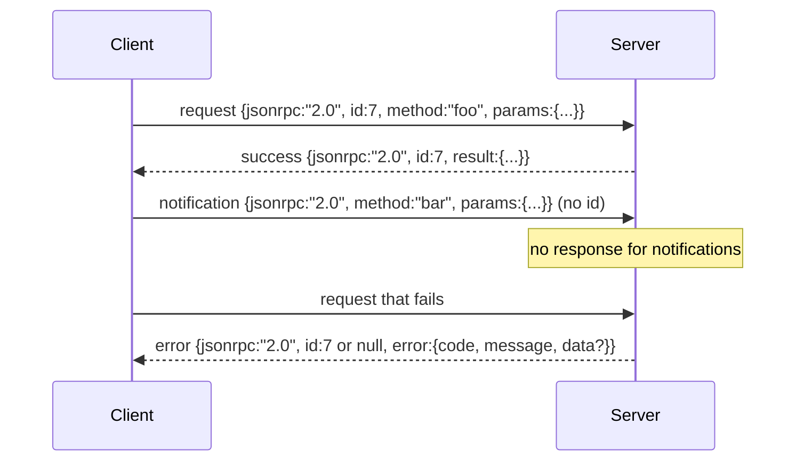

# JSON-RPC 2.0 Over Newline-Delimited Stdio

> النقل بين العميل النموذجي وخادم الأداة هو JSON-RPC عبر stdio. يعلمك دحرجتها يدويًا مرة واحدة ما تدفعه كل طبقة تأطير مقابل ذلك.

**النوع:** بناء
** اللغات: ** بايثون
**المتطلبات الأساسية:** المرحلة 13 دروس 01-07، المرحلة 14 الدرس 01
**الوقت:** ~90 دقيقة

## Learning Objectives
- Speak JSON-RPC 2.0 framed as newline-delimited JSON over stdin and stdout.
- Map the five standard error codes (-32700, -32600, -32601, -32602, -32603) and surface them with the right semantics.
- Distinguish requests, responses, notifications, and batches without inventing new envelope keys.
- Handle one parse error per line without poisoning the rest of the stream.
- Build a self-terminating demo using io.BytesIO so the lesson runs without spawning a child process.

## Why JSON-RPC stays the lingua franca

يتحدث وكيل الترميز في عام 2026 مع اثني عشر خادمًا للأدوات في جلسة واحدة. كل خادم عبارة عن عملية منفصلة أو نقطة نهاية بعيدة. ظل تنسيق السلك كما هو منذ عام 2013. JSON-RPC 2.0 عبارة عن مواصفات من صفحتين. لقد بقي لأن البدائل (gRPC، HTTP لكل مكالمة، ثنائي مخصص) جميعها تفرض مقايضة JSON-RPC لا: فهي تختار إما البث أو التجميع أو اقتران النقل. JSON-RPC متماثل عبر stdio، والمقابس، ومآخذ الويب، وHTTP، ويمكن للعميل قيادة خادم لم يسبق له رؤيته إذا كان كلاهما يحترم المواصفات.

يبني هذا الدرس متغير stdio. محدد بالسطر الجديد JSON. كل طلب هو سطر واحد. كل رد هو سطر واحد. حد النقل هو `\n`.

## The wire shape

توجد أربعة أشكال مغلف. اثنان يتحدث بها العميل. اثنان يتحدث بها الخادم.



لا يحتوي الإشعار على `id`. يجب ألا يستجيب الخادم لها. إذا قام الخادم بإرجاع استجابة لإشعار، فلن يكون لدى العميل أي طريقة لإرفاقه بموقع الاتصال. هذه القاعدة الوحيدة تجعل عملية التأطير بسيطة.

الدفعة عبارة عن مجموعة JSON من الطلبات أو الإشعارات. يرد الخادم بمجموعة من الردود، بأي ترتيب، واحدة لكل إدخال غير إعلام. إذا كان كل إدخال في الدفعة عبارة عن إشعار، فلن يرسل الخادم شيئًا مرة أخرى.

## The five error codes

```text
-32700  Parse error      JSON could not be parsed
-32600  Invalid Request  Envelope shape is wrong
-32601  Method not found
-32602  Invalid params
-32603  Internal error
```

الرموز بين -32000 و-32099 محجوزة للأخطاء المحددة من قبل الخادم. كل شيء آخر يتم تعريفه بالتطبيق. الدرس يلتصق بالخمسة. إذا تم رفع المعالج الخاص بك، فإن النقل يغلفه كـ -32603 مع اسم فئة الاستثناء في `data.exception`.

خطأ التحليل له قاعدة خاصة. `id` في الاستجابة هو `null`، لأن الطلب لم يتم تحليله بشكل كافٍ لاستخراج معرف.

## Newline framing and the BytesIO demo

يقرأ النقل سطرًا واحدًا في كل مرة. يصل طول السطر إلى `\n` ويحتوي على بايتات. إذا تعذر تحليل الخط، يكتب النقل استجابة -32700 بـ `id: null` ويستمر. التيار غير مسموم. يتم تحليل السطر التالي بشكل جديد.

بالنسبة للدرس، قمنا بتغليف زوج `io.BytesIO` كـ stdin وstdout. يقرأ الخادم الطلبات حتى EOF، ويكتب الإجابات لكل منها، ويعيدها. يقرأ العميل الردود مرة أخرى. لا توجد عملية تفرخ. لا مهلة. سلوك النقل مطابق لعملية فرعية حقيقية pipe لأن واجهة Python `io` تقدم نفس العقد `.readline()` و `.write()`.

## Method dispatch

النقل لا يعرف الطرق الموجودة. يتم تسليمه إلى `handler(method, params)` قابل للاستدعاء والذي يوفره الحزام. يقوم المعالج بإرجاع نتيجة أو يرفع. تظهر ثلاث فئات استثناءات رموزًا محددة.

```text
MethodNotFound -> -32601
InvalidParams  -> -32602
Anything else  -> -32603 with exception name in data
```

لا يرى النقل أبدًا سجل الأداة. التسجيل يجلس خلف المعالج. هذه هي الطبقات التي نريدها المواصلات تتحدث JSON-RPC. السجل يتحدث عن أشكال الأدوات. يقوم المرسل (الدرس الثالث والعشرون) بربطهما معًا.

## Stream behavior on errors

```text
client writes              server reads             server writes
---------------            -----------              -------------
{...valid request...}      parses ok                {...response, id matches...}
{...broken json...         parse fails              {id:null, error: -32700}
{...valid request...}      parses ok                {...response, id matches...}
{...missing method...}     invalid envelope         {id:X, error: -32600}
```

الخط المكسور JSON لا يوقف الحلقة. الحقل `method` المفقود لا يوقف الحلقة. استثناء المعالج لا يوقف الحلقة. يستمر النقل في القراءة حتى EOF.

## Notifications and asymmetric flows

الإخطار هو إطلاق النار والنسيان. يستخدم الحزام إشعارات لأحداث التقدم وإشارات الإلغاء وخطوط السجل. الإشعارات هي الطريقة التي يمكن بها لأداة تعمل لفترة طويلة أن تقوم ببث تحديثات الحالة دون التعثر في كل منها.

يستخدم الدرس مساعدًا واحدًا للإشعارات الصادرة، `write_notification`. يستخدمه الخادم لإصدار التقدم أثناء وجود الطلب. يُظهر العرض التوضيحي النمط: يأتي طلب، ويرسل المعالج إشعارين بالتقدم، ثم يكتب الرد النهائي.

## How to read the code

`code/main.py` يعرّف `StdioTransport`، ومساعد التحليل (`parse_request`)، ومساعدي الكتابة الثلاثة (`write_response`، `write_error`، `write_notification`)، وحلقة الإرسال `serve`. ثوابت رمز الخطأ موجودة في نطاق الوحدة النمطية.

يغطي `code/tests/test_transport.py` رموز الخطأ الخمسة، والإشعارات (لم تتم كتابة أي استجابة)، والدُفعات (المصفوفة الواردة، والمصفوفة الخارجة، وتخطي الإشعارات)، وJSON المعطلة (خطأ التحليل ثم المتابعة)، والتدفق غير المتماثل حيث يكتب المعالج إشعارًا في منتصف المكالمة.

## Going further

وهذا النقل يكفي للدروس التالية. تضيف وسائل نقل الإنتاج ثلاثة أشياء. حقل معرف الارتباط الذي يستمر في إعادة التوجيه ('0› الخاص بك هو هذا بالفعل، ولكن في الشبكة تحتاج إلى معرف تتبع خارجي أيضًا). قناة الإلغاء (إشعار مثل `$/cancelRequest` بمعرف المكالمة على متن الطائرة). ومصافحة تفاوضية من نوع المحتوى حتى يتمكن نفس المقبس من التحدث JSON-RPC وقابل للبث HTTP. لا أحد من هؤلاء يغير السلك. يضيفون البيانات الوصفية.
