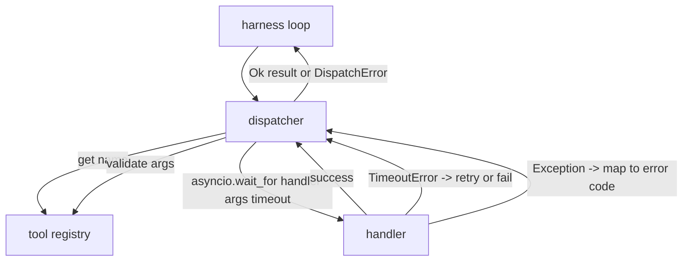
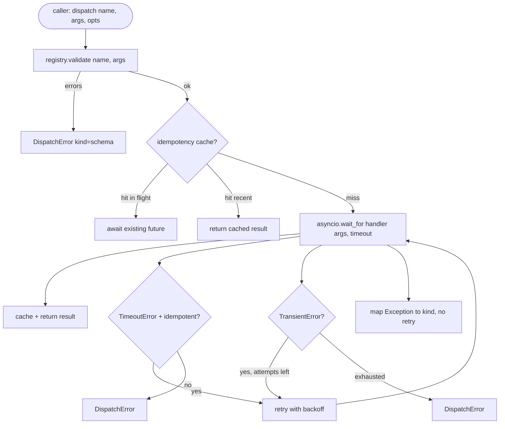

# Function Call Dispatcher

> المرسل هو المكان الذي يدفع فيه الحزام مقابل كل وعد يقدمه المخطط. المهلات، إعادة المحاولة، إزالة التكرار، تعيين الأخطاء. كل ذلك على التماس واحد.

**النوع:** بناء
** اللغات: ** بايثون
**المتطلبات الأساسية:** المرحلة 13 دروس 01-07، المرحلة 14 الدرس 01
**الوقت:** ~90 دقيقة

## Learning Objectives
- Wrap a tool handler in a per-call timeout that returns a typed error instead of hanging the loop.
- Apply exponential backoff retry with jitter and a maximum attempt count.
- Deduplicate retries on an idempotency key so a retry that races with a slow original does not run twice.
- Map handler exceptions and transport faults onto a single error envelope the harness loop already understands.
- Bound parallel dispatch with a concurrency limit so a fan-out of forty tool calls does not exhaust the event loop.

## Where the dispatcher sits

بين حلقة التسخير (الدرس العشرين) وسجل الأداة (الدرس الواحد والعشرون). النقل (الدرس الثاني والعشرون) يغذي الحلقة. تقوم الحلقة بتسليم استدعاء الأداة إلى المرسل. يقوم المرسل باستدعاء السجل وتشغيل المعالج وإرجاع نتيجة أو مظروف خطأ على شكل JSON-RPC.



المرسل هو الطبقة الوحيدة التي تعرف عن أجهزة ضبط الوقت، وإعادة المحاولة، والعجز. الحلقة لا. التسجيل لا. المعالج لا. هذه العزلة هي النقطة.

## Timeouts

كل أداة لها مهلة افتراضية. يحمل سجل التسجيل `timeout_ms`. يتجاوزه المرسل من تجاوز لكل مكالمة عندما يمرر الحزام واحدًا. نستخدم `asyncio.wait_for`. عند انتهاء المهلة، يتم إلغاء مهمة المعالج ويعود المرسل `DispatchError(kind="timeout")`.

لا تعتبر المهلة خطأً قابلاً لإعادة المحاولة بشكل افتراضي بالنسبة للأدوات غير الفعالة. `db.write` التي انتهت مهلتها قد تكون ملتزمة أو لا. إعادة المحاولة يكرر الكتابة. يقوم المرسل بوضع العلامة `idempotent` من سجل التسجيل. أدوات Idempotent إعادة المحاولة. الأدوات غير العاجزة لا تفعل ذلك.

## Retries with exponential backoff

سياسة إعادة المحاولة هي ثلاث محاولات كحد أقصى. التراجع هو الأسي مع غضب.

```text
attempt 1  -> delay 0
attempt 2  -> delay 0.1s * (1 + random[0..0.5])
attempt 3  -> delay 0.4s * (1 + random[0..0.5])
```

فقط قم بإعادة المحاولة من خلال الأخطاء `timeout` و `transient`. خطأ `schema`، أو `not_found`، أو خطأ `internal` لا يؤدي إلى إعادة المحاولة. أخطاء المخطط حتمية. إعادة المحاولة لا تغير النتيجة وتحرق الميزانية.

تحترم حلقة إعادة المحاولة الميزانية من الحزام. إذا كانت ميزانية المتصل لا تحتوي على مكالمات أدوات متبقية، فسيفشل المرسل بسرعة في المحاولة الأولى ويعيد `kind="budget_exceeded"`.

## Idempotency key dedupe

إن إعادة المحاولة التي يتم تشغيلها أثناء وجود النسخة الأصلية في حالة طيران هي خطأ حقيقي في الإنتاج. يتم تعليق المكالمة الأولى عند أربع ثوانٍ وتسع ثوانٍ (أقل من المهلة مباشرةً). يتم تشغيل إعادة المحاولة بعد خمس ثوانٍ. الآن يتنافس طلبان ضد نفس الواجهة الخلفية. إذا كانت الأداة `payments.charge`، فقد قمت بالشحن مرتين.

يقبل المرسل رمزًا اختياريًا `idempotency_key`. إذا كان نفس المفتاح في حالة طيران عند وصول مكالمة، فإن المرسل ينتظر المستقبل أثناء الرحلة ويعيد النتيجة. تحتفظ ذاكرة التخزين المؤقت بالمفاتيح لمدة ستين ثانية بعد الانتهاء لاستيعاب المحاولات المتأخرة.

المفتاح هو مسؤولية المتصل. الحزام يستمده من المخطط: `f"{step_id}:{tool_name}:{hash(args)}"`. لا يخترع المرسل المفاتيح، لأن اشتقاق المفتاح من الحجج وحدها يعني أن مكالمتين مختلفتين لغويًا تبدوان متماثلتين.

## Error envelope

يقوم الإرسال الفاشل بإرجاع شكل واحد.

```text
DispatchError
  kind        : "timeout" | "transient" | "schema" | "not_found" | "internal" | "budget_exceeded"
  message     : str
  attempts    : int
  jsonrpc_code: int   (one of -32601, -32602, -32603)
```

تقوم حلقة الحزام بتعيين `kind` إلى الحالة التالية. `schema` و `not_found` انتقل إلى `on_error` وقم بتشغيل إعادة التخطيط. `timeout` و `transient` انتقل إلى `on_error` وقد يتم إعادة التخطيط أو لا يتم إعادة التخطيط حسب المحاولات. `budget_exceeded` المشغلات `on_budget_exceeded`.

## Concurrency limit on fan-out

`gather(*calls)` يقوم بتشغيل جميع coroutines في وقت واحد. مع أربعين استدعاء للأداة، يكون ذلك أربعين مقبسًا مفتوحًا أو أربعين عملية فرعية pipes. لا تحب معظم الواجهات الخلفية أربعين اتصالاً متوازياً من عميل واحد.

يقوم المرسل بتغليف `gather` في إشارة. حد التزامن الافتراضي هو ثمانية. تكتسب كل مكالمة الإشارة قبل إرسالها وتحررها عند الانتهاء. يرى المتصل مخرجات على شكل `gather` ولكن الجدولة الفعلية محدودة.

## Flow for one call



## How to read the code

`code/main.py` يحدد `Dispatcher`، `DispatchError`، و `TransientError`. يأخذ المرسل التسجيل في البناء. يعتبر المتزامن `dispatch(name, args,...)` هو نقطة الدخول الوحيدة. يتم تطبيق المهلات لكل محاولة بشكل مضمن داخل `_run_with_retries` باستخدام `asyncio.wait_for`. `gather_bounded(calls)` يقوم بتشغيل العديد من الإرساليات مع حد التزامن.

يغطي `code/tests/test_dispatcher.py` إطلاق المهلة، وإعادة المحاولة مؤقتًا، وعدم إعادة المحاولة عند حدوث خطأ في المخطط، وإلغاء التكرار (مكالمتان متزامنتان مع انهيار المفتاح نفسه لاستدعاء معالج واحد)، وتقييد التزامن (الإشارة قيد التشغيل).

تستخدم الاختبارات المعالجات المستندة إلى `asyncio.sleep(0)` والمعالجات الحتمية `Counter`، بحيث تنتهي بالمللي ثانية ولا تعتمد على توقيت ساعة الحائط.

## Going further

إضافة اثنين من مرسلي إنتاج الملحقات. أولاً، التسجيل المنظم عند كل انتقال (وهو ما يوفره لك تدفق أحداث الحلقة بالفعل، ولكن يجب على المرسل أيضًا إرسال الأحداث `dispatch.attempt` و `dispatch.retry`). ثانيًا، قواطع الدائرة: بعد فشل N في النافذة، تحصل الأداة على فترة تهدئة حيث تعود الإرسالات فورًا بـ `kind="circuit_open"` بدلاً من محاولة المعالج. كلاهما يتناسب مع هذا المرسل دون تغيير العقد.

يقوم الدرس الرابع والعشرون بإلصاق المرسل بوكيل التخطيط والتنفيذ حتى تتمكن من رؤية القطع الأربع كلها تتحرك.
