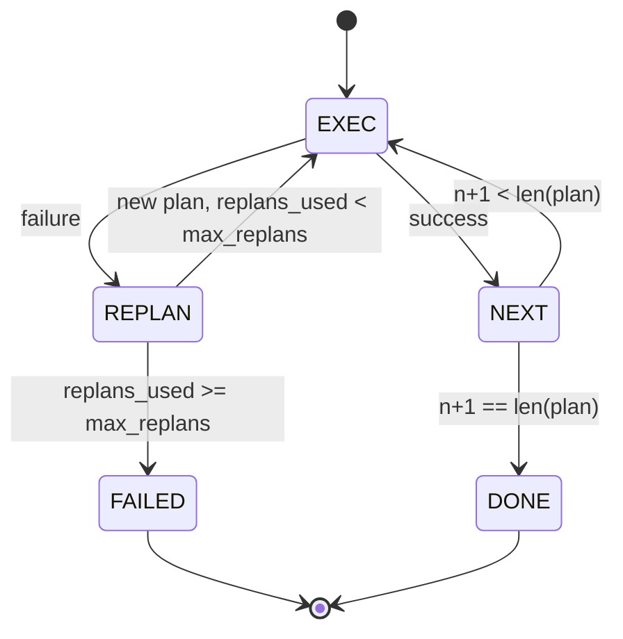

# Plan-Execute Control Flow

> الخطة التي لا يمكنها النجاة من الفشل هي عبارة عن نص. البرنامج النصي الذي يمكنه إعادة التخطيط هو وكيل. قم ببناء مخطط إعادة التخطيط أولاً.

**النوع:** بناء
** اللغات: ** بايثون
**المتطلبات الأساسية:** المرحلة 13 دروس 01-07، المرحلة 14 الدرس 01
**الوقت:** ~90 دقيقة

## Learning Objectives
- Represent a plan as an ordered list of typed steps so the executor can reason about progress and outcome.
- Execute steps sequentially with a controlled failure handoff back to the planner.
- Replan from the current cursor with the prior error in the context so the next plan is informed.
- Emit a plan diff on each revision so a downstream tracer or UI can show why the plan changed.
- Enforce two budgets: a hard step ceiling and a hard replan ceiling.

## Plan and execute, not chain-of-thought

يقوم وكيل سلسلة الأفكار بإصدار الرموز المميزة ويتيح للحلقة تخمين مكان انتهاء استدعاء الأداة. يقوم وكيل التخطيط والتنفيذ بإصدار خطة منظمة أولاً، ثم ينفذ كل خطوة بشكل حتمي. الخطة عبارة عن بيانات يمكن للأداة أن تتأملها. التنفيذ هو أداة تشغيل تلك البيانات من خلال المرسل.

قطعتين. المخطط الذي ينتج خطة. المنفذ الذي يدير الخطة. العمل المثير للاهتمام هو ما يحدث عندما يفشل المنفذ. ثلاثة خيارات:

```text
1. Abort         (return failed, surface the error)
2. Skip          (mark step failed, continue with the rest)
3. Replan        (hand the error to the planner, get a new plan from the cursor)
```

Replan هو الذي يحول البرنامج النصي إلى وكيل.

## The Step shape

```text
Step
  id              : int           (monotonic within a plan revision)
  tool_name       : str
  args            : dict
  expected_outcome: str           (planner's stated success condition)
  result          : Any | None
  error           : str | None
```

`expected_outcome` عبارة عن جملة قصيرة يرسلها المخطط بجانب الخطوة. ولا يتم تنفيذه من قبل المنفذ. وذلك لأمرين: أن يقرأها المعاد التخطيط عند مراجعة الخطة؛ يصدره دفق الحدث حتى يتمكن المتتبع من إظهار "كان من المفترض أن تقوم هذه الخطوة بـ X."

## The planner shape

```python
def planner(goal: str, history: list[Step], last_error: str | None) -> list[Step]:
    ...
```

وظيفة نقية. `goal` هو هدف المستخدم. `history` هي الخطوات التي تم تنفيذها بالفعل (مع ملء النتائج والأخطاء). `last_error` تشير إلى لا شيء في المكالمة الأولى وأحدث رسالة فشل في كل مكالمة لاحقة. يقوم المخطط بإرجاع الخطة التالية بدءًا من المؤشر.

المخطط لا يعرف عن المنفذ. أنه لا يعرف عن إعادة المحاولة. أنها لا تعرف عن المهلات. وتنتج خطة. هذا كل شيء.

## The executor

المنفذ هو آلة دولة صغيرة. كل خطوة تمر عبر المرسل. والنتيجة هي أحد ثلاثة أشياء: النجاح، والفشل الذي يمكن إعادة التخطيط له، والفشل القاتل. تعود حالات الفشل القابلة لإعادة التخطيط إلى المخطط. تؤدي حالات الفشل الفادحة (تجاوز الميزانية، إعادة التخطيط إلى الحد الأقصى) إلى إرجاع نتيجة جلسة `FAILED`.



## Plan diffs on revision

عندما يقوم المخطط بإرجاع خطة جديدة بعد الفشل، يقوم المنفذ بإصدار حدث `plan.diff` بثلاثة حقول.

```text
removed: list of step ids that were in the old plan and are not in the new
added  : list of step ids in the new plan that were not in the old
revised: list of step ids whose tool_name or args changed
```

يمكن للمتتبع أو UI أن يعرض هذا على شكل خط يتوسطه خط على الخطوات التي تمت إزالتها وإبراز الخطوات المضافة. النقطة ليست في تنسيق الفرق. النقطة المهمة هي أن المراجعة هي حدث مرئي، وليست إعادة كتابة صامتة.

## Two budgets, both hard

`max_steps` يحد من إجمالي عمليات تنفيذ الخطوات عبر الجلسة بأكملها، بما في ذلك عمليات إعادة التخطيط. الافتراضي هو اثني عشر. إن الخطة الخطية المكونة من خمس خطوات والتي يتم إعادة التخطيط لها مرتين وتضيف ثلاث خطوات في كل مرة تصل إلى ستة عشر عملية تنفيذ وتتجاوز الميزانية. سوف يرفض المنفذ إعادة الخطة ويعود FAILED.

`max_replans` يحدد عدد المرات التي يتم فيها استدعاء المخطط بعد الخطة الأولى. الافتراضي هو خمسة. وهذا هو الحد الأكثر أهمية. إن المخطط الذي يقوم بإرجاع نفس الخطة المعطلة خمس مرات متتالية سوف يتكرر حتى تلتقطها ميزانية الخطوة. وضع حد لخطط إعادة التخطيط make الفشل بشكل أسرع والسبب أوضح.

## The deterministic planner in this lesson

نحن لا نسمي نموذجا في هذا الدرس. يقدم الدرس مخططًا حتميًا يختار خطة بناءً على `last_error`.

```text
last_error is None    -> emit a four-step plan
last_error matches X  -> emit a three-step plan that routes around X
last_error matches Y  -> emit a two-step plan that gives up gracefully
otherwise             -> return [] (signals nothing to replan)
```

وهذا يكفي لاختبار سلوك المنفذ في كل مسار انتقالي: النجاح، وإعادة التخطيط مرة واحدة، وإعادة التخطيط مرتين، وإعادة التخطيط - استنفاد، واستنفاد الميزانية المرحلية.

## Result shape

```text
SessionResult
  status      : "completed" | "failed"
  reason      : str     ("goal_met" | "step_budget" | "replan_budget" | "no_plan")
  history     : list[Step]
  revisions   : list[PlanDiff]
  events      : list[Event]
```

يمكن لحلقة الحزام من الدرس العشرين قراءة هذا مباشرة. المرسل من الدرس الثالث والعشرين هو الذي ينفذ كل خطوة. يقوم التسجيل من الدرس الحادي والعشرين بالتحقق من صحة وسيطات كل خطوة. سيؤدي النقل من الدرس الثاني والعشرين إلى إظهار هذا التدفق بالكامل JSON-RPC إلى العميل النموذجي.

## How to read the code

`code/main.py` يحدد `PlanExecuteAgent`، `Step`، `PlanDiff`، `SessionResult`، والمخطط الحتمي. المنفذ هو أسلوب `run(goal)` واحد يُرجع `SessionResult`. يتم حساب فرق الخطة من خلال مقارنة معرفات الخطوات والصفوف `(tool_name, args)`.

يغطي `code/tests/test_agent.py` النجاح الخطي، والفشل في منتصف الخطة الذي يُعاد التخطيط مرة واحدة، واستنفاد إعادة التخطيط الذي يُرجع `failed:replan_budget`، واستنفاد الميزانية المرحلية، وتنسيق حدث اختلاف الخطة.

## Going further

سوف تحتاج إلى امتدادين بمجرد توصيل هذا بنموذج حقيقي. أولاً، التخزين المؤقت الجزئي للخطة: عندما تنجح الخطة في الخطوات الثلاث الأولى من الخطوات الست ثم تفشل، فإنك لا تريد إعادة تشغيل الخطوات الثلاث الأولى. المنفذ يحتفظ بالتاريخ بالفعل؛ يحتاج المخطط فقط إلى قراءته. ثانياً، الفروع المتوازية: المنفذ الحالي متسلسل بشكل صارم. يمكن للمخطط الذي يرسل فرعًا مستقلاً (`gather_step` بدلاً من `next_step`) تشغيل استدعاءين للأداة بشكل متزامن من خلال المرسل.

كلاهما يضيف تعقيدًا حقيقيًا. كلاهما أسهل في الإضافة بمجرد تثبيت المنفذ الخطي. وهذا ما يفعله هذا الدرس.
