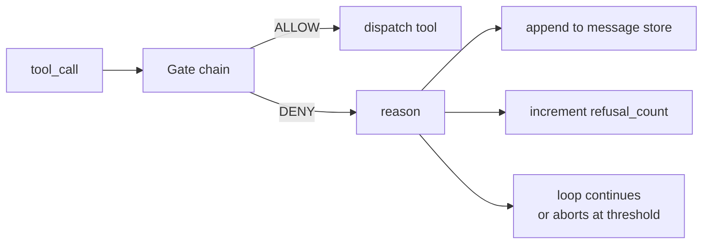
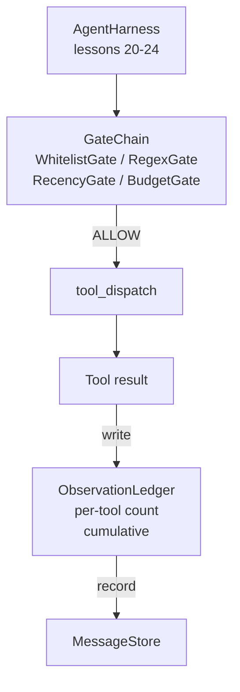

# Capstone Lesson 25: Verification Gates and the Observation Budget

> يعتبر حزام الوكيل بدون طبقة التحقق بمثابة رغبة في معطف واق من المطر. يبني هذا الدرس سلسلة البوابة الحتمية التي تقرر ما إذا كان مسموحًا بإطلاق استدعاء الأداة، وكم من مخرجاتها يُسمح للوكيل برؤيتها، ومتى يجب أن تتوقف الحلقة لأن الوكيل قد قرأ كثيرًا. السلسلة عبارة عن بوابات صغيرة مسماة بالإضافة إلى دفتر مراقبة يتتبع كل رمز مميز تم عرضه في النموذج.

**النوع:** بناء
** اللغات: ** بايثون (stdlib)
** المتطلبات الأساسية: ** المرحلة 19 · 20-24 (المسار A1: حلقة الوكيل، سجل الأدوات، مخزن الرسائل، منشئ موجه، جهاز توجيه النموذج)، المرحلة 14 · 33 (التعليمات كقيود)، المرحلة 14 · 36 (عقود النطاق)، المرحلة 14 · 38 (بوابات التحقق)
**الوقت:** ~90 دقيقة

## Learning Objectives

- بناء بروتوكول `VerificationGate` بطريقة حتمية `evaluate(call)`.
- قم بتكوين بوابات الميزانية والحداثة والقائمة البيضاء والتعبير العادي في سلسلة ذات دلالات ذات دائرة كهربائية قصيرة.
- تتبع كل ملاحظة من خلال مفتاح `ObservationLedger` بواسطة الأداة ثم قم بالتدوير.
- رفض استدعاء الأداة عندما يتم تجاوز ميزانية المراقبة التراكمية.
- قم بإدراج سجل `GateDecision` منظم يمكن أن تستوعبه إمكانية المراقبة النهائية.

## The Problem

عندما يتيح تسخير الوكيل للنموذج استدعاء الأدوات بحرية، تظهر ثلاث فئات من الأخطاء خلال الساعة الأولى من الاستخدام الحقيقي.

الأول هو الملاحظة غير المحدودة. تؤدي عملية grep عبر الريبو المكون من 200 ألف سطر إلى تفريغ نصف مليون رمز مميز من الإنتاج في المنعطف التالي. يرى النموذج تطابقًا واحدًا لكل كيلو بايت ويتم إهدار بقية السياق. فاتورة الرمز كبيرة والوكيل الآن أسوأ، وليس أفضل، في المهمة.

والثاني هو الحداثة التي لا معنى لها. تقوم المهمة طويلة الأمد بتجميع خمسين مكالمة للأداة. يعيد النموذج قراءة ملف read_file الأول من المنعطف الثالث كما لو كان حالة حية. لا تظهر التعديلات التي تم إجراؤها عند المنعطف السابع والأربعين أبدًا لأن المنشئ الفوري قام بتسلسل الملاحظات الأولى أولاً.

والثالث هو زحف الامتياز. تبدأ مهمة البحث بالاتصال بـ `web_search`، ثم ينتهي الأمر بطريقة ما بتشغيل `shell` لأن النموذج اخترع اسم أداة وتم ضبط الحزام على أنه مسموح. بحلول الوقت الذي يقرأ فيه أي شخص التتبع، يوجد ملف غير هام في /tmp ويتم تشغيل curl مقابل API خاص.

بوابة التحقق هي مكون الحزام الذي يقول لا. انها ليست نموذجا. إنه ليس قاضياً. إنها دالة حتمية لـ `(call, history, ledger)` تُرجع إما ALLOW أو DENY مع سبب. تم تسجيل السبب يقال النموذج. تستمر الحلقة أو يتم إحباطها.

## The Concept



البوابة هي أي شيء له طريقة `evaluate(call, ctx) -> GateDecision`. السلسلة عبارة عن قائمة مرتبة. تقييم الدوائر القصيرة عند الرفض الأول. النظام مهم: البوابات الهيكلية الرخيصة تعمل قبل بوابات عد الرموز باهظة الثمن.

يأتي هذا الدرس بأربعة أبواب:

- `WhitelistGate`. أسماء الأدوات المسموح بها هي مجموعة صريحة. وكل ما هو خارج ذلك مرفوض. هذه هي البوابة الأرخص وتعمل أولاً.
- `RegexGate`. تتم مطابقة وسيطات الأداة مع التعبير العادي. مفيد لرفض مكالمات shell التي تحتوي على `rm -rf`، أو HTTP مكالمات إلى عناوين IP الداخلية. نقية على حمولة المكالمة.
- `RecencyGate`. لا يرى النموذج سوى الملاحظات من المنعطفات N الأخيرة. الملاحظات القديمة ملثمة. ترفض البوابة استدعاء أداة تؤدي نتيجته إلى توسيع نافذة المراقبة التي تجاوز عمرها بالفعل.
- `BudgetGate`. الرموز المميزة التراكمية التي قرأها النموذج خلال الجلسة لها سقف. عندما يشير دفتر الأستاذ إلى أنه تم الوصول إلى السقف، يتم رفض كل استدعاء إضافي للأداة.

دفتر الملاحظات هو مسك الدفاتر. كل استدعاء ناجح للأداة يكتب صفًا واحدًا: اسم الأداة، الدوران، الرموز المنبعثة، التراكمية. يجيب دفتر الأستاذ على سؤالين: ما إجمالي ما شاهده النموذج، وما هو مقدار ما شاهده من الأداة X. تقرأ بوابة الميزانية السؤال الأول. تقرأ بوابة الميزانية لكل أداة، والتي ستكتبها كتمرين، البوابة الثانية.

## Architecture



تسخير يسأل السلسلة. السلسلة إما تومئ أو ترفض. إذا أومأت برأسها، يتم تشغيل الأداة، ويتم وضع علامة في دفتر الأستاذ، ويتم إلحاق النتيجة بمخزن الرسائل. إذا رفض، يتم تسليم النموذج الرفض كرسالة نظام وتقرر الحلقة ما إذا كان سيتم إعادة المحاولة أو الإيقاف.

## What you will build

التنفيذ عبارة عن اختبار واحد `main.py` زائد.

1. تحدد فئات البيانات `Observation` و `ToolCall` أشكال الأسلاك.
2. `ObservationLedger` السجلات `(turn, tool, tokens)` الصفوف والإجابات `cumulative()` و `per_tool(name)`.
3. `GateDecision` يحمل `(allow, reason, gate_name)`.
4. `VerificationGate` هو البروتوكول. تنفذ كل بوابة `evaluate(call, ctx)`.
5. `GateChain` يغلف قائمة مرتبة. يقوم باستدعاء كل بوابة، أو إرجاع الرفض الأول، أو إرجاع السماح إذا مرت كل بوابة.
6. يدير العرض التوضيحي حلقة وكيل اصطناعية صغيرة. ثلاث دورات. يقوم المنعطف الثالث برحلة إلى بوابة الميزانية وتبلغ الحلقة عن رفض نظيف مع عدد رفض غير صفري.

يعد عداد الرمز المميز بمثابة إرشاد غبي `len(text) // 4` عمدًا. الهدف من هذا الدرس هو سباكة البوابة، وليس الرمز المميز. إسقاط رمز مميز حقيقي في الإنتاج.

## Why the chain order matters

الرفض أرخص من السماح. `WhitelistGate` يعمل في بحث التجزئة O(1). `RegexGate` يعمل في O(pattern * argv). `RecencyGate` يقرأ شريحة صغيرة من مخزن الرسائل. `BudgetGate` يقرأ دفتر الأستاذ بأكمله. يمكنك طلبها عن طريق تصاعد التكلفة حتى يتم رفض الاتصال بالدوائر القصيرة قبل القيام بالعمل الباهظ الثمن.

يمكنك أيضًا طلبها حسب نصف قطر الانفجار. القائمة البيضاء هي أقوى ادعاء: هذه الأداة غير موجودة في العقد. بوابة regex هي التالية: هذه الوسيطة غير موجودة في العقد. تأتي الحداثة بعد ذلك: لا يزال الحزام يهتم ولكن المكالمة قانونية من الناحية الهيكلية. الميزانية هي الأخيرة لأنها، بحكم التعريف، يتم تفعيلها فقط عندما يمر كل شيء آخر.

## How this composes with the rest of Track A

لقد أعطتك الدروس السابقة الحلقة وسجل الأداة ومخزن الرسائل ومنشئ المطالبة وجهاز التوجيه النموذجي. يضيف هذا الدرس الطبقة بين النموذج والأدوات. يقوم الدرس 26 بشحن صندوق الحماية الذي يقوم المرسل بتسليم استدعاء الأداة إليه بمجرد أن تقول سلسلة البوابة ALLOW. يشحن الدرس 27 أداة التقييم التي تسجل حالات الرفض كإشارة جودة. يقوم الدرس 28 بتوصيل قرارات البوابة إلى امتدادات OpenTelemetry. يقوم الدرس 29 بدمج المجموعة في وكيل ترميز عامل.

## Running it

```bash
cd phases/19-capstone-projects/25-verification-gates-observation-budget
python3 code/main.py
python3 -m pytest code/tests/ -v
```

يطبع العرض التوضيحي تتبعًا خطوة بخطوة بما في ذلك كل قرار بشأن البوابة ويخرج من الصفر. تغطي الاختبارات دفتر الأستاذ، وكل بوابة على حدة، ودائرة قصر السلسلة، والحلقة الاصطناعية من طرف إلى طرف.
