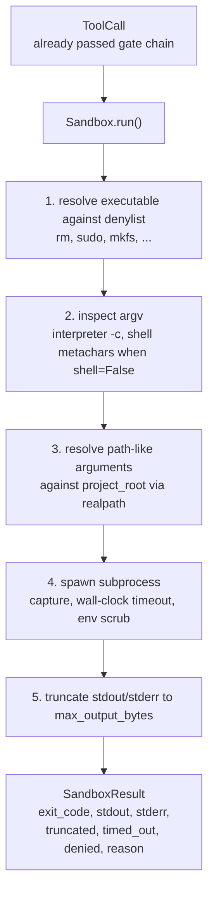
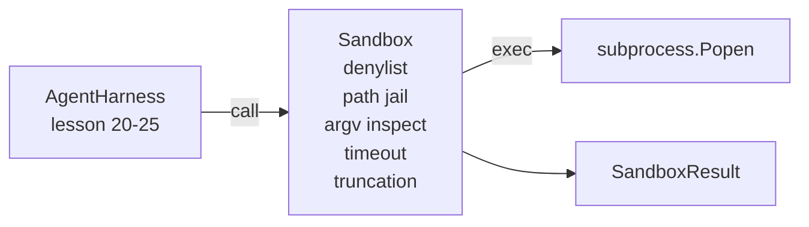

# Capstone Lesson 26: Sandbox Runner with Denylist and Path Jail

> تقرر بوابة التحقق ما إذا كان ينبغي تشغيل استدعاء الأداة أم لا. يقرر صندوق الرمل ما يحدث عندما يحدث. يشحن هذا الدرس مشغل عملية فرعية يرفض الملفات التنفيذية الخطيرة، ويرفض أشكال argv الخطيرة، ويسجن كل مسار ملف إلى جذر المشروع، ويقتطع المخرجات كبيرة الحجم، ويقتل العمليات الهاربة عند انتهاء مهلة ساعة الحائط. إنها الطبقة الثانية من الطبقتين الموجودتين بين النموذج ونظام التشغيل.

**النوع:** بناء
** اللغات: ** بايثون (stdlib)
**المتطلبات:** المرحلة 19 · 25 (بوابات التحقق وميزانية المراقبة)، المرحلة 14 · 33 (التعليمات كقيود)، المرحلة 14 · 38 (بوابات التحقق)
**الوقت:** ~90 دقيقة

## Learning Objectives

- أنشئ التفاف الفصل `Sandbox` `subprocess.run` مع انتهاء المهلة والالتقاط والاقتطاع.
- رفض الأمر بالاسم مقابل قائمة الرفض وبالبنية ضد مفتش argv.
- رفض أي وسيطة مسار يتم حلها خارج جذر المشروع المعلن.
- رفض الأحرف الأولية للصدفة عند إيقاف تشغيل وضع الصدفة.
- قم بإرجاع `SandboxResult` منظم يمكن أن تستوعبه إمكانية المراقبة النهائية وأداة التقييم.

## The Problem

يمكن لوكيل الترميز الذي يمكنه الاختراق تثبيت أبواب خلفية، وإخراج المفاتيح، وتركيب جهاز كمبيوتر محمول للمطورين، ورفع فاتورة سحابية في دورة واحدة. الدفاع الأقل تكلفة هو عدم إعطائه غلافًا. والثاني الأقل تكلفة هو صندوق الحماية الذي يقول لا لقائمة محددة من الأنماط.

ثلاث فئات من الفشل تتكرر في آثار الوكيل.

الأول هو الملفات التنفيذية الخطيرة. سيحاول النموذج تحت الضغط لإصلاح مشكلة المسار `sudo`، `chmod -R 777`، `rm -rf`، `mkfs`، `dd`. لا ينتمي أي من هؤلاء إلى تشغيل الوكيل. قائمة الرفض تلتقطهم بالاسم والاسم المستعار.

والثاني هو حيل argv. النموذج الذي تم إخباره بعدم وجود قذيفة سوف pipe هجوم من خلال مترجم: `python3 -c "import os; os.system('rm -rf /')"`، `bash -c '...'`، `node -e '...'`، `perl -e '...'`. يحتاج وضع الحماية إلى معرفة أن أي مترجم يتم تشغيله بعلامة تشبه `-c` هو مجرد استدعاء shell مع خطوات إضافية.

والثالث هو طريق الهروب. يُطلب من النموذج قراءة `./src/main.py` وبدلاً من ذلك يقرأ `../../etc/passwd`. يقوم صندوق الحماية بسجن كل وسيطة مسار عن طريق حلها من خلال `os.path.realpath` وتأكيد البادئة.

إن وضع الحماية ليس حدودًا أمنية بمعنى نظام التشغيل. لا يزال بإمكان المهاجم المصمم بتنفيذ التعليمات البرمجية الاختراق. صندوق الحماية عبارة عن حاجز حماية لوقت التطوير: إنه make هو أوضاع الفشل الشائعة بصوت عالٍ ويمنع الوكيل من إحداث الضرر بسبب عدم الكفاءة المطلقة.

## The Concept



يحتوي صندوق الحماية على أربعة محاور للرفض: الاسم، والأرجف، والمسار، والبنية. كل محور هو وظيفة خالصة للاستدعاء، ولا توجد عملية فرعية حتى الآن. تظهر العملية الفرعية فقط بعد مرور كل محور.

رموز الخروج `SandboxResult` هي الرموز التقليدية: 0 نجاح، فشل غير صفري، بالإضافة إلى ثلاثة رموز خافرة للرفض (-100)، وtimed_out (-101)، والمبتورة (رمز الخروج هو الرمز الحقيقي، مع مجموعة إشارة). تقرأ الدروس النهائية هذه النتيجة المنظمة بدلاً من تحليل stderr.

## Architecture



القائمة المرفوضة عبارة عن مجموعة مجمدة من الأسماء الأساسية القابلة للتنفيذ. الأسماء المستعارة (`/bin/rm`، `/usr/bin/rm`) جميعها تحل بنفس الاسم الأساسي. يعرف مفتش argv شكل المترجم: يتم رفض أي argv حيث argv[0] هو مترجم وأي وسيطة لاحقة تبدأ بـ `-c` أو `-e`. تتسبب أحرف Shell الأولية (`;`، `|`، `&`، `>`، `<`، backticcks، `$()`) في الرفض عندما لا يطلب الاستدعاء الصدفة بشكل صريح.

سجن المسار هو القطعة الأكثر دقة. يقبل صندوق الرمل `project_root` عند الإنشاء. تتم تسوية أي وسيطة تبدو كمسار (تحتوي على `/` أو تتطابق مع ملف موجود) من خلال `os.path.realpath`، ثم يتم التحقق منها مقابل المسار الحقيقي لجذر المشروع. إذا كان الهدف الذي تم حله ليس تحت الجذر، الرفض. يتم حظر محاولات الهروب من الارتباط الرمزي (ارتباط رمزي في جذر المشروع يشير إلى الخارج) عن طريق التحقق من المسار الحقيقي، وليس المسار الحرفي.

## What you will build

التنفيذ هو `main.py` بالإضافة إلى دليل الاختبارات.

1. `SandboxResult` فئة البيانات: كود الخروج، stdout، stderr، مبتورة، timed_out، مرفوض، السبب، Duration_ms.
2. `SandboxConfig` فئة البيانات: project_root، max_output_bytes، timeout_thans، Denlist، Interler_block.
3. `Sandbox` الفئة: `run(argv, *, shell=False, cwd=None)` تُرجع `SandboxResult`.
4. مساعدات الرفض الداخلي: `_check_executable_denylist`، `_check_argv_interpreter`، ,`_check_shell_metachars`,`_check_path_jail`، .
5. اقتطاع الإخراج بعلامة `truncated` واضحة وخط علامة في الدفق الملتقط.
6. العرض التوضيحي في الأسفل: سلسلة من مكالمات legitimate والخصومة. ويظهر كل منها مع نتيجته.

يستخدم صندوق الحماية `subprocess.run` مع `shell=False` بشكل افتراضي و`capture_output=True`. تستخدم مهلة ساعة الحائط الوسيطة `timeout`؛ في `TimeoutExpired`، يقوم صندوق الحماية بقتل مجموعة العمليات ويقوم بتجميع نتيجة Sandbox.

## Why this is not a real sandbox

لا يستخدم رمل الدرس مساحات الأسماء، أو مجموعات cgroup، أو seccomp، أو gVisor، أو Firecracker، أو أي عزل على مستوى kernel. أي شيء يمكن أن تفعله العملية الفرعية، يمكن لصندوق الحماية أن يفعله. الحماية هيكلية: يتم حرمان الوكيل من أكثر الاستدعاءات خطورة شيوعًا، ويتحول الرفض الصاخب إلى إمكانية الملاحظة بدلاً من الجري بصمت.

بالنسبة لوكلاء الإنتاج، يمكنك وضع طبقة في الأعلى: التشغيل داخل حاوية Docker غير المميزة، والتشغيل داخل microVM، وإسقاط الإمكانات، وتثبيت جذر المشروع للقراءة فقط، ونقطة خدش للقراءة والكتابة، وتعيين ulimit على الذاكرة وCPU، ومسح البيئة إلى قائمة بيضاء معروفة وآمنة. الدرس 29 يوضح بعضًا من هذا. عزل نظام التشغيل خارج نطاق هذا الدرس.

## Running it

```bash
cd phases/19-capstone-projects/26-sandbox-runner-denylist
python3 code/main.py
python3 -m pytest code/tests/ -v
```

يقوم العرض التوضيحي بإنشاء دليل مؤقت، وإسقاط ملف نظيف فيه، ثم تشغيل مجموعة من المكالمات. تنجح المكالمات القانونية. تُرجع المكالمات المرفوضة SandboxResult بـ `denied=True` وسبب. تعود المهلات `timed_out=True`. Truncation sets `truncated=True`. يطبع العرض التوضيحي جدول النتائج JSON ويخرج من الصفر.

## How this composes with the rest of Track A

الدرس 25 أنتج سلسلة البوابة. الدرس 26 هو المنفذ الذي يجري خلف البوابة ALLOW. يقوم نظام التقييم الخاص بالدرس 27 بمقارنة نتائج وضع الحماية مع رمز الخروج المتوقع لكل مهمة. يُصدر الدرس 28 مسافة `gen_ai.tool.execution` حول كل استدعاء `Sandbox.run`. يقوم العرض التوضيحي الشامل للدرس 29 بتوصيل وكيل تشفير حقيقي عبر كلتا الطبقتين.
