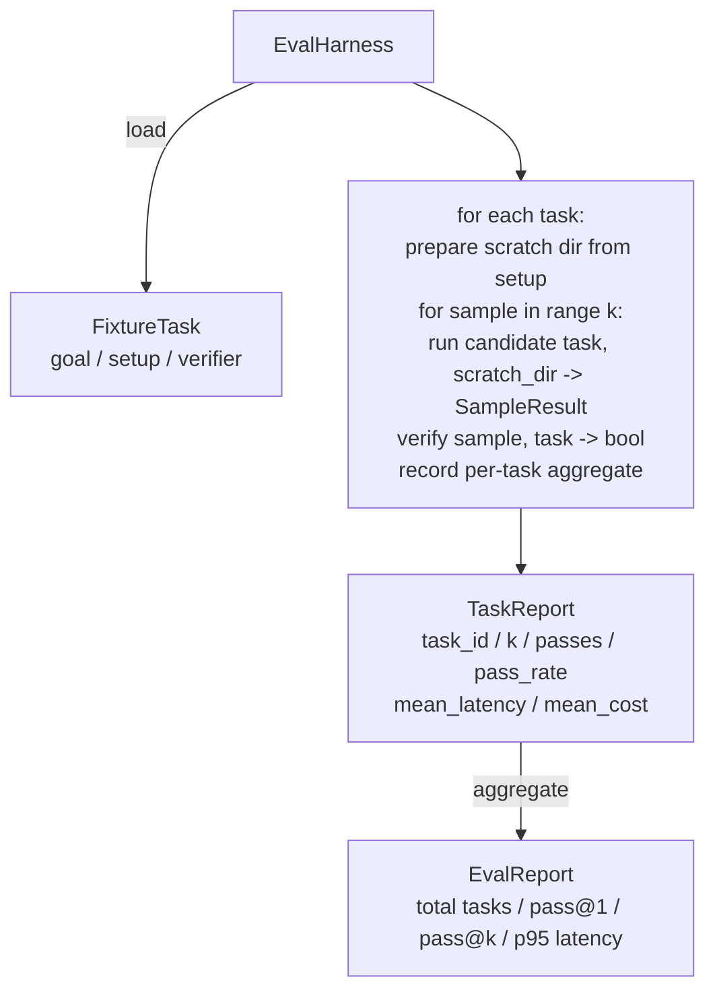

# Capstone Lesson 27: Eval Harness with Fixture Tasks

> يكون وكيل البرمجة جيدًا بقدر مجموعة المهام التي تقيسه بها. يبني هذا الدرس أداة تقييم تأخذ مجلدًا من المهام الثابتة، ويتم تشغيل كل منها من خلال وكيل مرشح، وتمرير الدرجات أو الفشل من خلال أداة التحقق الحتمية، وتجميع النتائج في pass@1، وpass@k، ومتوسط ​​زمن الوصول، ومتوسط ​​التكلفة. الحزام هو مصدر الحقيقة الذي يتيح لك معرفة الانحدار من معيد البناء.

**النوع:** بناء
** اللغات: ** بايثون (stdlib)
** المتطلبات الأساسية: ** المرحلة 19 · 25 (بوابات التحقق)، المرحلة 19 · 26 (عداء وضع الحماية)، المرحلة 14 · 30 (تطوير الوكيل القائم على التقييم)، المرحلة 14 · 19 (SWE-مقاعد البدلاء وGAIA المعايير)
**الوقت:** ~90 دقيقة

## Learning Objectives

- تحديد مهمة ثابتة باعتبارها ثلاثية الهدف، والإعداد، والتحقق.
- تسجيل عدة نماذج تشغيل لكل مهمة وحساب pass@1 وpass@k.
- تجميع زمن الوصول والتكلفة في المتوسط ​​والمقاييس المئوية 95.
- قم بتوصيل أدوات التحقق الحتمية (فرق الملف، رمز الخروج، مطابقة التعبير العادي) إلى وظائف قابلة لإعادة الاستخدام.
- قم بإصدار تقرير منظم JSON يمكن أن يستوعبه البرنامج النصي لتتبع الانحدار.

## The Problem

ثلاثة أوضاع للفشل تصيب معايير الوكيل التي تم إنشاؤها بدون أدوات تقييم.

الأول هو تمريرة لم يتم التحقق منها. يقول الوكيل إنه أصلح الخلل، ونظر الإنسان إلى الاختلاف، وتم وضع علامة على المجموعة باللون الأخضر، وبعد ثلاثة أسابيع أظهر اختبار الانحدار نفس الخطأ. كان الوكيل قد فكر بشكل معقول دون إصلاح أي شيء فعليًا.

والثاني هو الانحدار غير المكتشفة. تغيير في قالب المطالبة make يجعل الوكيل أفضل بنسبة 4% في المهمة الصاخبة و14% أسوأ في المهمة الهادئة. بدون المجموعة الذهبية والنتيجة لكل مهمة، ينتقل الانحدار إلى المستوى الرئيسي ويظهر فقط عندما يشتكي العميل.

والثالث هو الانجراف لكل مهمة. تم إجراء التقييم يوم الاثنين مع 100 مهمة ويوم الجمعة مع 95 منها، لأن أحد الأشخاص أعاد تسمية خمس تركيبات. يبدو أن معدل النجاح قد تحسن بنسبة 5٪. إنه ليس كذلك.

والأداة هي البرنامج الذي يحول هذه الإخفاقات إلى حقائق. فهو يقوم بتشغيل كل تركيبات، في كل مرة، بترتيب قابل للتكرار، مقابل أداة التحقق التي تُرجع صوابًا أو خطأً في فحص حتمي.

## The Concept

```mermaid
flowchart LR
  F1[fixtures/task_001/<br/>task.json + expected/] --> Harness
  F2[fixtures/task_002/<br/>...] --> Harness
  Harness[Harness<br/>for each task:<br/>setup / run agent k samples /<br/>verify each sample /<br/>record latency, cost]
  Harness --> Report[EvalReport<br/>pass@1 / pass@k<br/>mean ms / p95 ms<br/>mean cost]
```

`FixtureTask` هو ملف JSON صغير بالإضافة إلى دليل `expected/` اختياري. يعلن JSON عن `id`، و`goal` (الموجه الذي يتم تغذيته إلى الوكيل)، وكتلة `setup` (الملفات التي سيتم إسقاطها في دير التسويد)، وكتلة `verifier`. تقوم كتلة التحقق بتسمية وظيفة في سجل أداة التحقق الخاصة بالأداة وتوفر الوسائط الخاصة بها.

تغطي ثلاثة أشكال للتحقق غالبية المهام المفيدة.

الأول هو `file_equals`. بعد تشغيل الوكيل، قم بمقارنة الملف المسمى بالمحتوى المتوقع. يؤدي هذا إلى اكتشاف مهام "إصلاح هذا الخطأ بهذه الطريقة بالضبط".

والثاني هو `regex_match`. تتم مطابقة محتويات الملف المحدد مع regex. يؤدي هذا إلى اكتشاف مهام "يجب أن تكون الوظيفة موجودة وترجع X" حيث يوجد العديد من الحلول المقبولة.

والثالث هو `shell_exit_zero`. يقوم الحزام بتشغيل أمر shell (من خلال وضع الحماية من الدرس 26) ويمرر المهمة فقط إذا خرج الأمر من الصفر. يؤدي هذا إلى اكتشاف مهام "يجب اجتياز الاختبارات".

يقوم الحزام بتشغيل كل مهمة `k` مرات. Pass@k هو `1 - (1 - p)^k` حيث p هو معدل النجاح التجريبي؛ يُبلغ الحزام أيضًا عن الأعداد الأولية حتى تتمكن من اكتشاف التباين. الكمون هو ساعة الحائط لكل عينة. التكلفة هي ما يبلغ عنه الوكيل بنفسه (عدد الرموز المميزة، USD، أو كليهما)؛ يقوم الحزام بجمعها عبر العينات ويقدم الأرقام لكل مهمة والأرقام الإجمالية.

## Architecture



المرشح قابل للاستدعاء: `Callable[[FixtureTask, str], SampleResult]`. يقوم الحزام بإنشاء دليل الصفر عبر `tempfile.mkdtemp()` ويمرر مساره كسلسلة عادية. الحزام لا يهتم بكيفية عمل المرشح. يمكن أن يكون المرشح مُطبِّقًا حتميًا (مفيدًا للاختبارات الذاتية)، أو وكيل LLM حقيقي، أو غامض. العقد هو SampleResult.

## What you will build

`main.py` السفن:

1. `FixtureTask` فئة البيانات.
2. `SampleResult` فئة البيانات: تقرير النجاح الذاتي، زمن الاستجابة، وحدات التكلفة، التعديلات.
3. `TaskReport`، `EvalReport` فئات البيانات مع `to_dict()`.
4. `VerifierRegistry` تعيين اسم مدقق التعيين للعمل. أدوات التحقق المضمنة: file_equals، وregex_match، وshell_exit_zero.
5. `EvalHarness` الفصل. يقوم بتشغيل دليل المهام ضد أحد المرشحين. إرجاع تقرير التقييم.
6. خمس مهام تركيبية مجمعة في `tasks/`: - إيقاف تلو الآخر خلال `fizzbuzz` - عائد مفقود في `factorial` - خطأ مطبعي في رسالة الخطأ - جسم وظيفي فارغ - خارج واحد في اجتياز القائمة المرتبطة
7. مرشح مرجعي حتمي (`apply_known_fixes`) يستخدمه الحزام لإظهار تمريرة نظيفة عند 1 من 1.0.
8. يقوم العرض التوضيحي بطباعة تقرير EvalReport JSON ويخرج من الصفر.

يتم تجميع مهام التثبيت كملفات JSON في `tasks/` بالإضافة إلى ملفات مصدر مقترنة في `tasks/<id>/buggy/` و`tasks/<id>/expected/`. يقوم الحزام بنسخ عربات التي تجرها الدواب في دير الصفر، ويسلمها إلى المرشح، ويتحقق من المتوقع.

## Why pass@k and not just pass@1

وكلاء LLM الحقيقيون هم عشوائيون. يبدو أن pass@1 بقيمة 0.6 فاشل. يشير تمرير @ 5 من 0.95 إلى أن الوكيل يحصل على الإجابة الصحيحة في معظم الأوقات ولكنه يختار الخطأ في العينات المبكرة. الحل هو أخذ العينات والتصنيف، وليس المزيد من التدريب دائمًا. Pass@k makes هذا مرئي.

يتم الإبلاغ عن Pass@k جنبًا إلى جنب مع pass@1 لأن pass@k يشير إلى فشل حقيقي: إذا حصل النموذج على الإجابة الصحيحة مرة واحدة كل عشرين محاولة، فلن يكون لديك وكيل مفيد. ويظهر الحزام على حد سواء.

## How this composes with the rest of Track A

الدرس 25 أنتج سلسلة البوابة. أنتج الدرس 26 صندوق الرمل. يستخدم الحزام صندوق الحماية لأي أداة تحقق `shell_exit_zero`. يلخص الدرس 28 كل مجموعة يتم تشغيلها في تتبع OTel. يقوم الدرس 29 بتشغيل العرض التوضيحي الشامل مقابل إحدى التركيبات المجمعة ويؤكد pass@1 = 1.0 للمرشح المرجعي.

## Running it

```bash
cd phases/19-capstone-projects/27-eval-harness-fixture-tasks
python3 code/main.py
python3 -m pytest code/tests/ -v
```

يطبع العرض التوضيحي تقرير EvalReport بتنسيق JSON، بما في ذلك pass@1 وpass@5 ومتوسط ​​زمن الوصول والتوزيع لكل مهمة. رمز الخروج هو صفر. تغطي الاختبارات وظائف التحقق، والرياضيات pass@k، وتحميل التركيبات، والأداة الشاملة ضد المرشح المرجعي المجمع.
