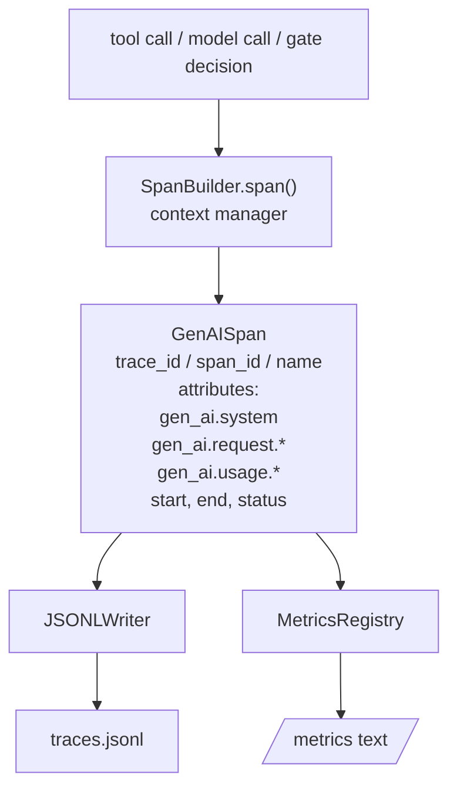
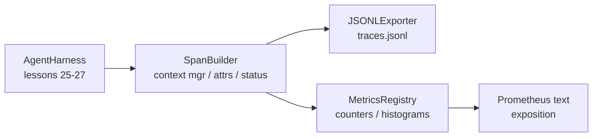

# Capstone Lesson 28: Observability with OTel GenAI Spans and Prometheus Metrics

> إن أداة تسخير الوكيل التي لا يمكن ملاحظتها هي صندوق أسود يكلف أموالاً. يقوم هذا الدرس بتدوين أداة إنشاء الامتدادات التي تصدر سجلات متوافقة مع اصطلاحات الدلالات OpenTelemetry GenAI، وكتابتها في ملف JSON-Lines فترة واحدة لكل سطر، ويكشف العدادات والرسوم البيانية بتنسيق نص Prometheus. الأمر برمته هو stdlib Python ويعمل دون اتصال بالإنترنت.

**النوع:** بناء
** اللغات: ** بايثون (stdlib)
** المتطلبات الأساسية: ** المرحلة 19 · 25 (بوابات التحقق)، المرحلة 19 · 26 (وضع الحماية)، المرحلة 19 · 27 (حزام التقييم)، المرحلة 13 · 20 (OpenTelemetry GenAI)، المرحلة 14 · 23 (اتفاقيات OTel GenAI)
**الوقت:** ~90 دقيقة

## Learning Objectives

- إنشاء فئة بيانات تمتد على شكل اصطلاحات الدلالية OpenTelemetry GenAI.
- تنفيذ مُصدر JSONL الذي يكتب نطاقًا واحدًا مستقلاً في كل سطر.
- إنشاء عدادات ورسوم بيانية باستخدام التسميات وعرض بتنسيق نص بروميثيوس.
- لف أي قابل للاستدعاء في مدير السياق الممتد الذي يسجل المدة والحالة والاستثناءات.
- التحقق من أن الامتدادات المنبعثة تمتد ذهابًا وإيابًا خلال `json.loads` ومطابقتها للشكل المحدد.

## The Problem

يقوم وكيل الترميز في الإنتاج بإنتاج ثلاث فئات من المنتجات في كل دورة: استدعاء النموذج، وتنفيذ الأداة، وقرار بوابة التحقق. لا شيء من هذا مفيد بدون القياس عن بعد المنظم.

وضع الفشل الأول هو التتبع المفقود. حدث خطأ ما يوم الثلاثاء ولكن السجل الوحيد هو سجل محادثة مكون من 500 سطر. لا يوجد سجل للأداة التي تم تشغيلها، أو المدة التي استغرقتها، أو عدد الرموز المميزة التي تم إرسالها إلى الموجه، أو ما إذا كانت البوابة قد رفضت أي شيء. يجب على المؤلف الوكيل أن يخمن.

وضع الفشل الثاني هو التتبع غير القابل للتحليل. كتب الحزام امتدادات ولكنه استخدم أسماء الحقول المخصصة الخاصة به. لا شيء في Grafana أو Honeycomb أو Jaeger أو CLI المحلي يمكنه قراءتها. مهما كانت الأدوات الموجودة في مكدس الفريق يتم إهدارها لأن الامتدادات غير قياسية.

وضع الفشل الثالث هو المقياس غير المجمع. يمكنك رؤية استدعاء أداة بطيء واحد في التتبع، لكن لا يمكنك الإجابة على "ما هو زمن الوصول p95 لاستدعاءات read_file خلال الساعة الماضية؟" لأنه لا توجد مقاييس، فقط آثار.

توجد اصطلاحات الدلالية OpenTelemetry GenAI خصيصًا لهذا الغرض. وهي تحدد مجموعة صغيرة من السمات القياسية التي تمتد عبر البواعث عبر LLM مشاركة الأطر. إذا كان الحزام الخاص بك يكتب تلك السمات، فيمكن لكل واجهة خلفية متوافقة مع OTel قراءتها.

## The Concept



كل عملية في الحزام تنتج مسافة. يحتوي النطاق على معرف تتبع (استدعاء الوكيل بالكامل)، ومعرف نطاق (هذه العملية الواحدة)، واسم (على سبيل المثال `gen_ai.chat`، `gen_ai.tool.execution`)، والسمات التي تتبع اصطلاحات GenAI، ووقت البداية والنهاية، والحالة.

تعمل اتفاقيات GenAI على توحيد مفاتيح السمات هذه: `gen_ai.system` (أي مزود، على سبيل المثال `anthropic`، `openai`)، `gen_ai.request.model` (معرف النموذج)، `gen_ai.request.max_tokens`، `gen_ai.usage.input_tokens`، `gen_ai.usage.output_tokens`، `gen_ai.response.model`، `gen_ai.response.id`، `gen_ai.operation.name`، بالإضافة إلى المفاتيح الخاصة بالأداة `gen_ai.tool.name` و `gen_ai.tool.call.id`.

المصدر يكتب JSONL. كائن JSON واحد في كل سطر. هذا هو أبسط تنسيق ممكن يمكن للأدوات النهائية دفقه ودمجه واستيراده. سيتحدث مُصدر OTel الحقيقي بـ OTLP gRPC؛ مُصدر الدرس JSONL هو المعادل دون اتصال بالإنترنت ويخرج من الصفر في كل محطة عمل.

المقاييس تعيش بجانب الآثار. يزيد العداد عند كل استدعاء للأداة: `tools_called_total{tool="read_file"}`. يسجل الرسم البياني زمن الوصول الملحوظ: `tool_latency_ms{tool="read_file"}`. كلاهما متسلسل في تنسيق عرض نص بروميثيوس، وهو المعيار الفعلي للمقاييس القائمة على السحب.

## Architecture



إن منشئ النطاق عبارة عن فئة صغيرة تستخدم أسلوب `span(name, attrs)` الذي يُرجع مدير السياق. يسجل مدير السياق وقت البدء عند الدخول، ويسجل وقت الانتهاء عند الخروج، ويرفق استثناء إذا تم رفعه، ويدفع النطاق النهائي إلى المصدر.

سجل المقاييس عبارة عن نقطتين. العدادات هي `{(name, frozen_labels): int}`. تحتفظ الرسوم البيانية بالعينات الأولية في قائمة وتتسلسل إلى دلاء الرسم البياني لبروميثيوس في وقت العرض.

## What you will build

`main.py` السفن:

1. `GenAISpan` فئة البيانات: Trace_id،span_id،parent_span_id، الاسم، السمات، start_unix_nano، end_unix_nano، الحالة، رسالة_الحالة، الأحداث.
2. `SpanBuilder` فئة مع `span(name, attrs, parent=None)` مدير السياق.
3. فئة `JSONLExporterLExporter` تحتوي على `export(span)` تُلحق سطرًا واحدًا.
4. `Counter` و `Histogram` الفئتان بالإضافة إلى `MetricsRegistry`.
5. `prometheus_exposition(registry)` ينتج مخرجات بتنسيق النص.
6. `wrap_tool_call(name)` مصمم ينبعث من الامتداد ويقوم بتحديث المقاييس.
7. العرض التوضيحي: يقوم بتجميع استدعاء كامل للوكيل (gen_ai.chat يمتد حول امتدادات الأداة)، ويكتب Traces.jsonl، ويطبع عرض Prometheus، ويخرج صفرًا.

معرف النطاق ومعرف التتبع عبارة عن سلاسل سداسية مكونة من 16 بايت، تم إنشاؤها من `os.urandom`. يطابق سياق تتبع OTel W3C. المصدر لا يرمي أبدا. IO ظهرت الأخطاء ولكن الحزام يستمر في العمل.

يحتوي الرسم البياني على مجموعة دلو ثابتة (افتراضي OTel لوقت الاستجابة بالمللي ثانية: 5، 10، 25، 50، 100، 250، 500، 1000، 2500، 5000، 10000، +Inf). يتم تخزين العينات كقائمة. يحسب العرض أعداد كل مجموعة عند الطلب.

## Why hand-rolled instead of opentelemetry-sdk

يعد OTel Python SDK تبعية حقيقية. وهي أيضًا عبارة عن عدة آلاف من أسطر التعليمات البرمجية، وعمليات متعددة لمصدر OTLP، وتكلفة وقت التشغيل التي تغرق ميزانية الدرس. النسخة الملفوفة يدويًا تعلم تنسيق السلك. في الإنتاج، تقوم بتوصيل نفس السمات إلى SDK الحقيقي وتحصل على مُصدِّر OTLP والتجميع واكتشاف الموارد مجانًا.

الاتفاقيات مستقرة. سيستمر تنسيق السلك الذي يصدره الدرس في التحليل في عام 2030 لأن OTel لا يكسر أبدًا أسماء سمات GenAI؛ يضيفون فقط جديدة.

## How this composes with the rest of Track A

الدرس 25 أنتج سلسلة البوابة. أنتج الدرس 26 صندوق الرمل. أنتج الدرس 27 أداة التقييم. الدرس 28 make الثلاثة يمكن ملاحظتها. يلخص الدرس 29 كل خطوة من العرض التوضيحي الشامل في فترات ويطبع نص بروميثيوس في النهاية.

## Running it

```bash
cd phases/19-capstone-projects/28-observability-otel-traces
python3 code/main.py
python3 -m pytest code/tests/ -v
```

يُصدر العرض التوضيحي علامة `traces.jsonl` في دليل عمل الدرس (يتم تنظيفه في النهاية)، ثم يطبع عينة من ثلاثة امتدادات، ثم يطبع عرض بروميثيوس للعدادات والرسوم البيانية. تتحقق الاختبارات من أن الامتدادات يتم تسلسلها ذهابًا وإيابًا، وأن سمات GenAI الأساسية موجودة، وأن العدادات تزيد بشكل صحيح، وأن عرض الرسم البياني يحتوي على أعداد الجرافة المتوقعة.
