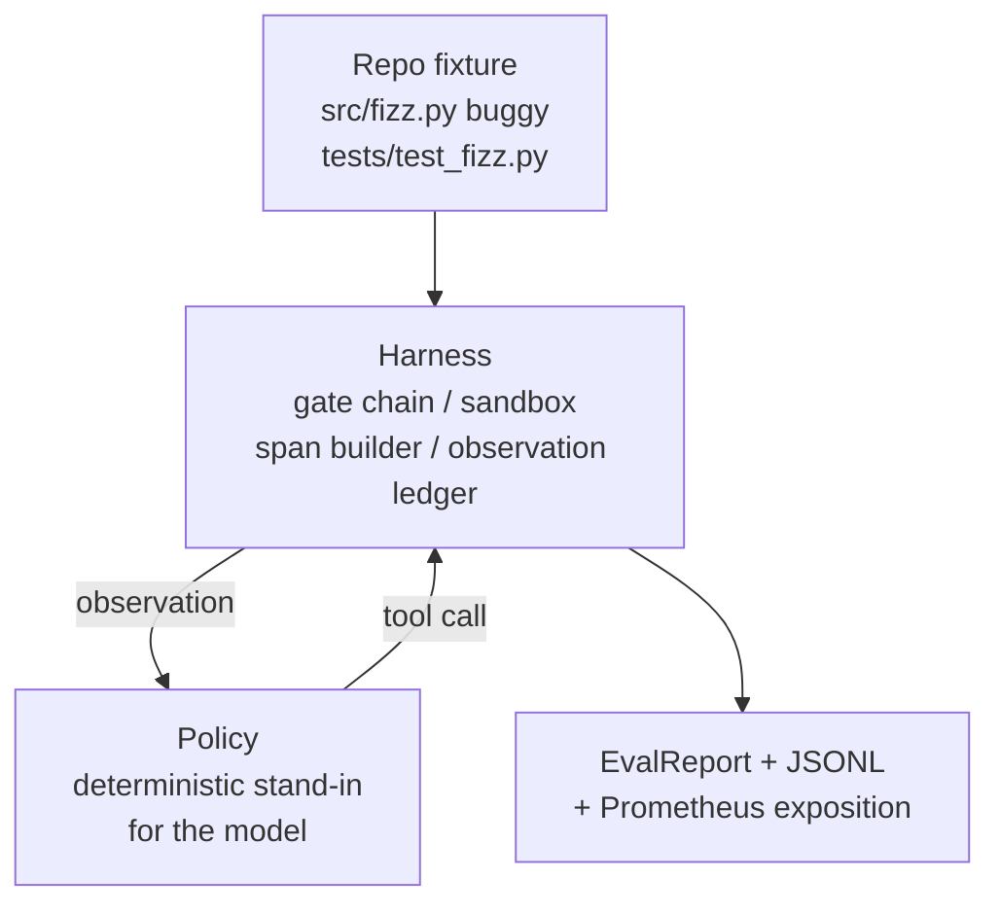
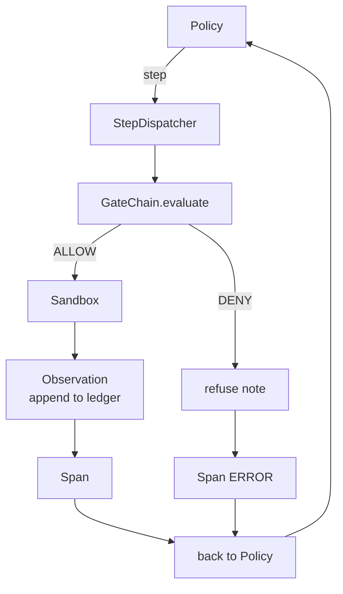

# Capstone Lesson 29: End-to-End Coding Agent on the Harness

> مكافأة المسار أ. يجمع هذا الدرس سلسلة البوابة، وصندوق الحماية، وحزام التقييم، ويمتد OTel إلى وكيل تشفير عامل واحد يعمل على إصلاح خطأ حقيقي (صغير، على نطاق ثابت) في مشروع Python متعدد الملفات. الوكيل هو سياسة حتمية، وليس LLM؛ الاستبدال make هو الدرس القابل للتكرار ويظهر أن الحزام كان الجزء المثير للاهتمام طوال الوقت. العقد متطابق: نموذج حقيقي يتم توصيله عند خط التماس السياسي.

**النوع:** بناء
** اللغات: ** بايثون (stdlib)
** المتطلبات الأساسية: ** المرحلة 19 · 25 (بوابات التحقق)، المرحلة 19 · 26 (صندوق الحماية)، المرحلة 19 · 27 (أداة التقييم)، المرحلة 19 · 28 (إمكانية الملاحظة)، المرحلة 14 · 38 (بوابات التحقق)، المرحلة 14 · 41 (منضدة عمل اتفاقيات إعادة الشراء الحقيقية)، المرحلة 14 · 42 (منصة عمل الوكيل)
**الوقت:** ~90 دقيقة

## Learning Objectives

- قم بتكوين سلسلة البوابة، وصندوق الحماية، وحزام التقييم، ومنشئ الامتداد في حلقة وكيل واحدة.
- تنفيذ سياسة حتمية تستخدم read_file وrun_tests وwrite_file لإصلاح خطأ التثبيت.
- فرض ميزانية خطوة عالمية بالإضافة إلى ميزانية رمز المراقبة عبر التشغيل الشامل.
- قم بإصدار آثار OTel GenAI الكاملة ومقاييس Prometheus للتشغيل الكامل.
- التحقق من قيام الوكيل بحل المشكلة في أقل من 12 خطوة بدون رحلات البوابة الصفرية باستخدام الأدوات القانونية.

## The Problem

تعمل معظم العروض التوضيحية للوكلاء بشكل منفصل: صندوق الحماية بمفرده، وأداة التقييم بمفردها، وباعث الامتداد بمفرده. تبدو جيدة. يؤلفها وتظهر طبقات.

سلسلة البوابة تقول ALLOW لكن صندوق الرمل يرفض لسبب لم تتوقعه السلسلة. تسجل أداة التقييم تمريرة لكن امتدادات OTel تقول إن البوابة رفضت الأداة التي يدعي الوكيل أنها استخدمتها. تتم زيادة عداد بروميثيوس مرتين بينما يجب زيادته مرة واحدة. تم تجاوز ميزانية المراقبة لكن الوكيل استمر في العمل لأنه تم تتبع الميزانية في السلسلة ولم يعرف صندوق الحماية.

هذا الدرس هو اختبار التكامل للمسار بأكمله. يجب على الوكيل القيام بأربعة أشياء بالترتيب: قراءة المشروع، وتشغيل الاختبارات، وتحديد الخطأ من فشل الاختبار، وكتابة الإصلاح، وإعادة تشغيل الاختبارات، والتوقف. كل عملية تمر عبر سلسلة البوابة. يتم تنفيذ كل أداة عبر وضع الحماية. كل خطوة ملفوفة في فترة. يسجل حزام التقييم كل شيء في النهاية.

## The Concept



سياسة الوكيل هي آلة الدولة. خمس ولايات.

`SURVEY`: يقرأ الوكيل قائمة المشروع. الحالة التالية هي RUN_TESTS.

`RUN_TESTS`: يقوم الوكيل بتشغيل أمر الاختبار. إذا نجحت الاختبارات، تتوقف آلة الحالة بنجاح. وإلا فإن الحالة التالية هي INSPECT.

`INSPECT`: يقرأ الوكيل الملف المصدر الفاشل. الحالة التالية هي FIX.

`FIX`: يقوم الوكيل بكتابة الملف المصحح. الحالة التالية هي VERIFY.

`VERIFY`: يقوم الوكيل بتشغيل أمر الاختبار مرة أخرى. إذا نجحت الاختبارات، توقف عن النجاح. وإلا توقف مع الفشل.

كل حالة تتوافق مع استدعاء الأداة. تمر كل مكالمة أداة عبر سلسلة البوابة. إذا تم رفض استدعاء أداة، يقوم الوكيل بالإبلاغ عن الرفض في التتبع ويتوقف.

خطأ التثبيت هو خطأ تلو الآخر في `fizz.py`. تكتشف السياسة الحتمية الخطأ من رسالة فشل الاختبار عبر التعبير العادي وتصدر الملف المصحح. استبدال البوليصة بـ LLM لا يغير عقد الحزام.

## Architecture



الدرس قائم بذاته. تتم إعادة تنفيذ كل درس أولي سابق على نطاق صغير في `main.py` (البوابة، صندوق الحماية، دفتر الأستاذ، الامتداد) بحيث يتم تشغيل الدرس دون استيراد الأشقاء. تتطابق الأسماء مع الدروس 25-28 تمامًا، لذا فإن رسم الخرائط المفاهيمية لا لبس فيه.

## What you will build

`main.py` السفن:

1. أساسيات الحزام الأدنى، منسوخة بنفس أسماء الدروس 25-28: `GateChain`، `Sandbox`، `ObservationLedger`، `SpanBuilder`، `MetricsRegistry`.
2. `CodingAgentPolicy` الصنف: آلة الحالة بخمس حالات.
3. `Repo` المساعد: يقوم بإعداد أداة الخدش باستخدام أداة العربة المرفقة.
4. فئة `AgentRun`: تقود السياسة، وترسل من خلال الحزام، وترجع `AgentRunReport`.
5. أداة مجمعة (`fixture_repo/`) مع src/fizz.py، وtests/test_fizz.py، وشجرة متوقعة لأداة التقييم.
6. العرض التوضيحي: تشغيل السياسة من البداية إلى النهاية، وطباعة التتبع خطوة بخطوة، وتأكيد النجاح، وطباعة المقاييس.

التركيبة المجمعة هي نفس شكل بنية مهمة الدرس 27: ملف به أخطاء وملف اختبارات. تحتوي رسالة فشل الاختبار على معلومات كافية للسياسة الحتمية لتحديد الإصلاح. من شأن LLM الحقيقي أن يؤدي نفس الوظيفة، بشكل أبطأ وباستدعاء أوسع، لكنه لن يغير توقعات الحزام.

## Why the policy is not an LLM

يتطلب LLM الحقيقي مفتاح API ومكالمة عبر الشبكة ومؤشر عشوائي لا يمكن التحقق منه. الحزام هو الجزء الذي يهتم به الدرس. يتيح الخضوع لسياسة حتمية تشغيل الدرس على أي كمبيوتر محمول للمطورين بدون أي تبعيات خارجية ويتيح لمجموعة الاختبار تأكيد عدد الخطوات الدقيق.

سياسة الدرس عبارة عن مجموعة فرعية صارمة مما يفعله وكيل LLM. تقرأ السياسة الريبو، وترى الاختبار الفاشل، وتحدد الخط، وترسل الإصلاح. يمر LLM بنفس الحلقة بنفس عقد الحزام؛ مسك الدفاتر متطابق.

## What the demo asserts

يؤكد العرض التوضيحي الشامل على خمسة أشياء في وقت الخروج، وتعيد مجموعة الاختبار تأكيدها برمجيًا.

قامت السياسة بحل المشكلة في أقل من 12 خطوة.

ولم يتم تجاوز ميزانية المراقبة أبدا.

تم إطلاق رفض بوابة الصفر على الأدوات القانونية. (لم يخترع الوكيل مطلقًا اسم أداة مرفوضة.)

كل خطوة لها مدى مناظر في ملف Traces.jsonl.

يحتوي معرض بروميثيوس على إدخال `tools_called_total{tool="read_file"}` ورسم بياني `tool_latency_ms`.

## How this composes with the rest of Track A

هذا الدرس هو التكامل الدرس 25 كتب سلسلة البوابة. الدرس 26 كتب الرمل. الدرس 27 كتب تسخير التقييم. كتب الدرس 28 إمكانية الملاحظة. يثبت الدرس 29 أنهم يعملون كنظام. يمتد تسخير الوكيل الحقيقي من هنا: استبدل السياسة الحتمية بنموذج، واستبدل التركيبات المجمعة بمهمة إعادة شراء حقيقية، واستبدل مُصدر JSONL بـ OTLP.

## Running it

```bash
cd phases/19-capstone-projects/29-end-to-end-coding-task-demo
python3 code/main.py
python3 -m pytest code/tests/ -v
```

يطبع العرض التوضيحي تتبعًا لكل خطوة، وتقرير التقييم النهائي، وعرض بروميثيوس. رمز الخروج هو صفر. تغطي الاختبارات تحولات حالة السياسة، ورفض البوابة عند استدعاءات الأدوات الاصطناعية، والتشغيل الشامل للتركيبات المجمعة، وثوابت الميزانية.
