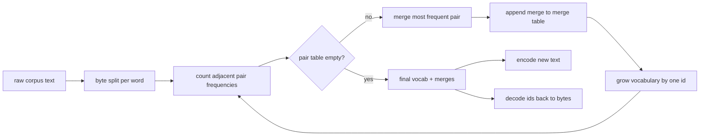
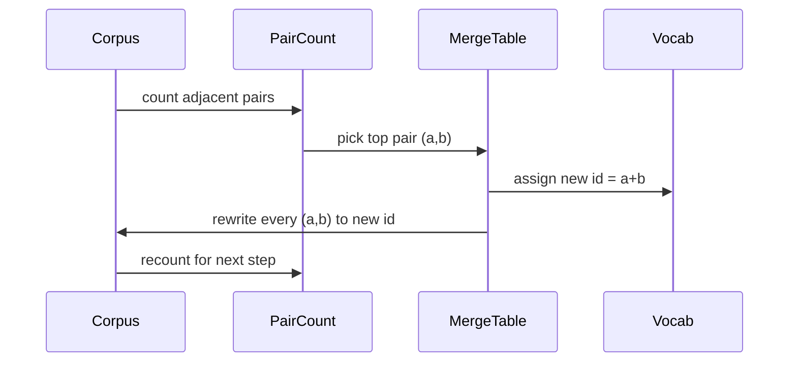

# BPE Tokenizer From Scratch

> البايتات الواردة والمعرفات الخارجة والمعرفات تعود إلى نفس البايتات. قم ببناء الرمز المميز الذي لا يزال يبدأ منه كل نموذج نص حديث.

**النوع:** بناء
** اللغات: ** بايثون
**المتطلبات الأساسية:** دروس المرحلة 04، دروس المرحلة 07 للمحولات
**الوقت:** ~90 دقيقة

## Learning Objectives
- Train a Byte-Pair Encoding vocabulary from a raw text corpus by repeatedly merging the most frequent adjacent symbol pair.
- Implement a deterministic merge table and apply it to fresh text to produce a stream of subword ids.
- Round-trip arbitrary UTF-8 input to ids and back without information loss.
- Reserve and protect special tokens (`<|endoftext|>`, `<|pad|>`) so they survive training and decoding.
- Reason about why a byte-level alphabet is the right floor for a general-purpose tokenizer.

## The frame

نموذج اللغة لا يرى النص أبدًا. يرى الأعداد الصحيحة. الخريطة من سلسلة إلى قائمة الأعداد الصحيحة والعودة هي الرمز المميز. أخطأ في فهم هذه الطبقة وكل منحنى خسارة في التدريب يقيس الشيء الخطأ.

العائلة السائدة من رموز الكلمات الفرعية لنماذج النص العامة هي Byte-Pair Encoding. الفكرة صغيرة. ابدأ بأبجدية معروفة. ابحث عن زوج الرموز المجاور الذي يظهر غالبًا في مجموعة التدريب. دمجها في رمز جديد. كرر حتى تصل المفردات إلى الحجم المستهدف. يؤدي ترميز النص الجديد إلى إعادة استخدام نفس قائمة الدمج وبنفس الترتيب.

سنقوم ببناء متغير على مستوى البايت. الأبجدية هي 256 بايت أولية، وليست نقاط ترميز Unicode. هذا الاختيار هو ما يتيح لأداة الرمز المميز التعامل مع أي إدخال UTF-8 دون الرجوع إلى رمز مميز غير معروف.

## The pipeline

يتشارك جانب التدريب وجانب الاستدلال في جدول الدمج. تلك المشاركة هي العقد. إذا قمت بتغيير ترتيب الدمج عند الاستدلال، فإنك تقوم بفك تشفير دفق مختلف من المعرفات.

## The byte alphabet

يتم حجز أول 256 معرفًا للبايتات الأولية من 0x00 إلى 0xFF. وهذا يضمن إمكانية التعبير عن كل سلسلة إدخال في المفردات قبل حدوث أي دمج. بعد كتلة البايت، نحتفظ بنطاق صغير للرموز الخاصة. لا تقترح حلقة التدريب مطلقًا هذه المعرفات كأهداف دمج لأننا نبقيها خارج التدفق المُرمز مسبقًا تمامًا.

يقوم أداة الرمز المسبق بتقسيم النص على مسافة بيضاء وحدود علامات الترقيم قبل أن يراها التدريب. بدون هذا التقسيم، ستتعلم خطوة الدمج BPE بسعادة عمليات الدمج التي تعبر حدود الكلمات وتمتلئ المفردات بعبارات شائعة كاملة. مع التقسيم، تبقى عمليات الدمج داخل الكلمة ويتم تعميم النتيجة.

## The training loop

في كل خطوة تدريب تقوم الحلقة بثلاثة أشياء. فهو يتتبع كل كلمة في المجموعة ويحسب عدد مرات ظهور كل زوج متجاور من الرموز الحالية، مرجحًا عدد مرات ظهور الكلمة نفسها. فإنه يختار الزوج مع أعلى عدد. فهو يعيد كتابة كل تكرار لهذا الزوج في رمز واحد جديد يكون معرّفه هو الفتحة المجانية التالية في المفردات. ثم يسجل الدمج.

تكون تكلفة كل خطوة خطية في حجم المجموعة المعبر عنها كقائمة من تسلسلات الرموز. بالنسبة لمليون كلمة ومفردات مستهدفة تبلغ عشرة آلاف معرف، يتم تشغيل الحلقة حتى اكتمالها في ثوانٍ لأن تسلسل الرموز يتقلص عند دمج الأرض.

## Encoding fresh text

لا يستدعي الاستدلال عداد الدمج. يقوم بتطبيق جدول الدمج بنفس الترتيب الذي تم تعلمه. بالنسبة للكلمة الجديدة، يبدأ برنامج التشفير من تقسيم البايت. يقوم بمسح التسلسل الحالي بحثًا عن الدمج الأقل تصنيفًا (الأقدم الذي يتم تطبيقه). ينفذ هذا الدمج. يقوم بمسح مرة أخرى. تنتهي الحلقة عندما لا ينطبق أي دمج في الجدول على التسلسل الحالي.

الترتيب حسب الرتبة هو الخاصية التي makes ترميز الحتمية وتطابق سلوك التدريب على نفس المدخلات. يتم وضع الدمج الذي تم تعلمه أولاً في أعلى الجدول ويتم تطبيقه أولاً. إذا أمكن تطبيق عمليتي دمج في نفس الموضع، فإن الدمج ذو المرتبة الأدنى هو الذي يفوز.

## Special tokens

الرموز المميزة هي معرفات لا يمكن لتدفق البايت إنتاجها أبدًا. نحن نحتفظ بها باليد. اثنان يكفي لهذا الدرس.

- `<|endoftext|>` يفصل المستندات أثناء التدريب المسبق. إنه يخبر النموذج "أن المستند الجديد يبدأ هنا، لا تدع سياق المستند السابق يتسرب."
- `<|pad|>` يملأ التسلسلات القصيرة بحيث يمكن أن تكون الدفعة عبارة عن موتر مستطيل. يخفيه قناع الخسارة أثناء التدريب.

يقبل برنامج التشفير علامة للسماح برموز خاصة في الإدخال. مع إزالة العلامة، يتم ترميز السلاسل `<|endoftext|>` و `<|pad|>` باعتبارها وحدات البايت التي توضحها. مع تشغيل العلامة، يتم تعيين السلاسل الحرفية إلى معرفاتها المحجوزة ولا تخضع لأي دمج.

## Round-trip guarantee

يجب أن يقوم التشفير ثم فك التشفير بإرجاع بايتات الإدخال بالضبط. تقوم وحدة فك التشفير بتسلسل توسيع البايت لكل معرف بالترتيب. نظرًا لأن كل معرف هو إما بايت خام أو سلسلة من معرفين معروفين مسبقًا، فإن التوسيع العودي ينتهي دائمًا بالبايتات الأولية. يقوم فك التشفير بعد ذلك بإرجاع السلسلة UTF-8 التي تكتبها تلك البايتات.

تتحقق مجموعة الاختبار في هذا الدرس من هذه الخاصية في الجملة غير المرئية، وفي الجملة التي تحتوي على Unicode emoji، وفي الجملة التي تحتوي على الرمز المميز `<|endoftext|>` حرفيًا.

## What this lesson does not do

إنها لا تقوم ببناء رمز مميز يعتمد على التعبيرات المنطقية بأسلوب أكبر رموز الإنتاج. الرمز المسبق هنا عبارة عن مسافة بيضاء صغيرة وتقسيم لعلامات الترقيم. يكفي إنشاء عمليات دمج معقولة في مجموعة تدريب صغيرة ويظل العقد مع بقية أفراد سلسلة الدروس كما هو. يتعامل الدرس التالي مع أداة الرمز المميز كمربع أسود ويبني مجموعة بيانات النافذة المنزلقة فوقه.

لا يوازي عداد الزوج. تنتهي الحلقة في بايثون على مجموعة مكونة من بضعة آلاف من الكلمات في أقل من ثانية. بالنسبة للمجموعات الكبيرة، فإن الخطوة الواضحة هي حساب أزواج كل كلمة بالتوازي وتقليلها.

## How to read the code

`main.py` يحدد أربعة كائنات. `BPETokenizerTokenizer` يحتوي على المفردات وجدول الدمج وجدول الرموز المميزة. `train` هي حلقة التدريب. `encode` هو مسار الاستدلال. `decode` هو تسلسل البايت. يقوم العرض التوضيحي الموجود في الأسفل بتدريب أداة رمزية صغيرة على مجموعة مدمجة، وترميز جملة معلقة، وفك تشفير المعرفات، وطباعة كليهما. تثبت الاختبارات الموجودة في `code/tests/test_bpe.py` خاصية ذهابًا وإيابًا وحجز الرمز المميز وترتيب الدمج.

قم بتشغيل العرض التوضيحي. ثم قم بتغيير حجم المفردات المستهدفة في العرض التوضيحي من 300 إلى 600 وشاهد كيف ينخفض ​​الطول المشفر للجملة المعلقة. هذا المنحنى هو منحنى الضغط BPE.
