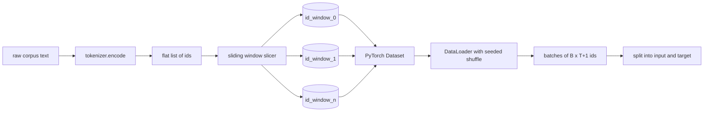
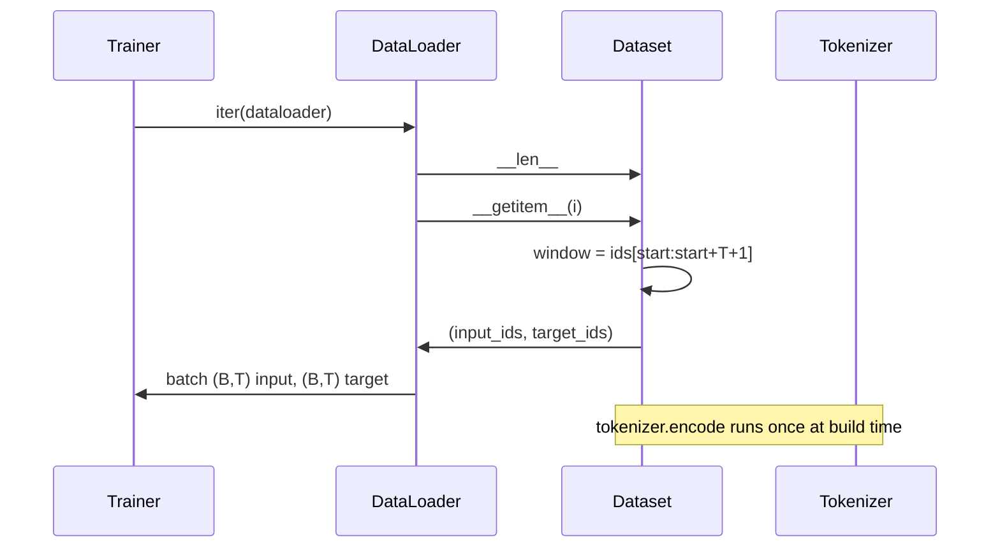

# Tokenized Dataset with Sliding Window

> تشغيل التدريب المسبق عبارة عن وظيفة من معرفات الرموز المميزة إلى التدرجات. يقوم هذا الدرس ببناء الناقل الذي يغذي المعرفات.

**النوع:** بناء
** اللغات: ** بايثون
**المتطلبات الأساسية:** دروس المرحلة 04، دروس المرحلة 07 للمحولات، الدرس 30 من هذه المرحلة
**الوقت:** ~90 دقيقة

## Learning Objectives
- Convert a raw corpus into a stream of token ids by calling the tokenizer once.
- Slice the id stream into fixed-length windows with a configurable overlap stride.
- Build a PyTorch Dataset that returns input and target tensors for next-token prediction.
- Wrap the dataset in a DataLoader with a deterministic shuffle seeded per epoch.
- Reason about the trade-off between stride, redundancy, and effective dataset size.

## The frame

يقرأ تشغيل التدريب المسبق دفعة واحدة من معرفات الرموز المميزة في كل مرة ويقوم بتحديث النموذج. يتم تحديد شكل كل دفعة من خلال عقد التدريب. بالنسبة لنموذج اللغة السببية، تحتوي المجموعة على معرفات الإدخال `(B, T)` ومعرفات الهدف `(B, T)` حيث يكون الهدف هو إدخال تم إزاحته إلى اليسار بمقدار واحد. وظيفة البيانات pipeline هي إنتاج هذا العقد عند الطلب، بطريقة حتمية وقابلة للتكرار، من مجموعة قد تصل إلى عدة غيغابايت من النص الخام.

يبني هذا الدرس الخط pipe. يقوم أداة الرمز المميزة من الدرس السابق بتحويل النص إلى قائمة مسطحة طويلة من المعرفات. شرائح نافذة منزلقة تدرج في أمثلة التدريب. تعرض مجموعة البيانات المخصصة الأمثلة كموترات. يقوم DataLoader بتجميعها وخلطها ببذرة معروفة.

## The shape contract

السببية LM تستهلك معرفات الشكل `(B, T)` حيث `B` هو حجم الدفعة و `T` هو طول السياق. الهدف في الموضع `t` هو الإدخال في الموضع `t+1`. وهذا يعني أن كل مثال تدريبي يغطي `T+1` معرفات أولية. تتحكم خطوة النافذة في مقدار التداخل الموجود بين الأمثلة المتتالية.

لا تتداخل أداة التقطيع أبدًا مع حدود الجسم. إذا لم تكن النافذة الأخيرة تحتوي على معرفات كافية لملء المواضع `T+1`، فستقوم أداة التقطيع بإسقاطها. يعد حشو الذيل بـ `<|pad|>` خيارًا صالحًا أيضًا ولكنه يزيد من تعقيد قناع الخسارة. لهذا الدرس نسقط.

## Why a sliding window

مجموعة التدريب المسبق عبارة عن تيار طويل من المعرفات. إذا كان النموذج يرى فقط نوافذ غير متداخلة، فإن كل مثال تدريبي سيعلمه نفس الحدود `T`. يؤدي ضبط الخطوة إلى تحريك تلك الحدود بحيث يرى النموذج المزيد من المهام المتنوعة للتنبؤ بالرمز المميز التالي.

تؤدي الخطوة `T` إلى ظهور نوافذ غير متداخلة. تؤدي الخطوة `T // 2` إلى تداخل بنسبة خمسين بالمائة ومضاعفة مجموعة البيانات الفعالة. تؤدي الخطوة `1` إلى الحد الأقصى من التداخل وزيادة مجموعة البيانات بعامل `T`. التكلفة هي حساب أكثر لكل عصر. الفائدة هي المزيد من التنوع الحدودي. تستخدم معظم عمليات التدريب المسبق خطوة مساوية لطول السياق لأن المجموعة أكبر بكثير مما يمكن أن ينتهي النموذج في فترة واحدة، وبالتالي فإن حجة التنوع الحدودي أضعف.

## The Dataset class

تحتوي مجموعة البيانات PyTorch على طريقتين مطلوبتين. `__len__` يُرجع عدد الأمثلة. `__getitem__` تقوم بإرجاع مثال واحد كزوج من الموترات. تقوم مجموعة البيانات الخاصة بنا بتخزين دفق المعرف المشفر والخطوة. تحسب الفهرسة فيه بداية النافذة بسرعة، وبالتالي فإن تكلفة الذاكرة هي نسخة واحدة من تدفق المعرف بغض النظر عن عدد الأمثلة التي تنتجها الخطوة.

يحدث النقل تلو الآخر داخل `__getitem__`. تقوم مجموعة البيانات بإرجاع `(input, target)` حيث `input = window[:-1]` و`target = window[1:]`. كلاهما PyTorch موتر طويل. تعاملهم حلقة التدريب على أنها حقيقة أساسية.

## Deterministic shuffle

يقرأ DataLoader الذي يحتوي على `shuffle=True` من مولد عشوائي PyTorch. من خلال تمرير مصنف `torch.Generator` صريح لكل فترة، نحصل على نفس التبديل العشوائي في كل مرة يتم فيها إعادة تشغيل التشغيل. هذه الخاصية مهمة عندما تريد مقارنة عمليتي تشغيل تختلفان فقط في معلمة تشعبية واحدة. بدون بذرة، ترى الجريتان البيانات بترتيبات مختلفة وتتباعد منحنيات الخسارة لأسباب لا علاقة لها بالتغيير.

عقد البذور في هذا الدرس بسيط. `epoch_seed = base_seed + epoch_index`. يتم تمرير البذور الأساسية عند البناء. يتم زيادة مؤشر العصر بواسطة المدرب في أعلى كل عصر. دائمًا ما تشهد إعادة التشغيل بنفس البذرة الأساسية نفس الترتيب في كل عصر.

## Batch sampler

يقوم جهاز أخذ العينات الافتراضي في PyTorch باختيار المؤشرات بشكل عشوائي بشكل موحد مع تعطيل الاستبدال. وهذا ما نريده للتدريب المسبق. بالنسبة للضبط الدقيق لمجموعة بيانات صغيرة، يكون العقد هو نفسه. يقوم DataLoader بتجميع دفعة عن طريق استدعاء `__getitem__` `B` مرات وتجميع النتائج. نظرًا لأن كل مثال له نفس الطول حسب البناء، فلا حاجة إلى منطق الحشو.

يحتفظ الدرس بـ `num_workers=0` للتبسيط. في عملية الإنتاج، يقوم العمال بموازاة المكالمات `__getitem__`. مع pipeline الذي يعد في الغالب محظورًا لأن العمل هو مجرد شريحة من موتر في الذاكرة، ولكن نفس مجموعة البيانات API تدعم العمال بشكل نظيف.

## Counting examples

بالنسبة لتدفق معرف بطول `N`، وطول السياق `T`، وخطوة `S`، فإن عدد الأمثلة هو `max(0, 1 + (N - (T + 1)) // S)`. يعرض الدرس هذا الحساب كطريقة ثابتة في مجموعة البيانات حتى يتمكن المدرب من حساب إجمالي الخطوات لكل فترة دون تكرار.

## What this lesson does not do

لا يتدفق من القرص. يتم ترميز المجموعة بالكامل في الذاكرة ويتم الاحتفاظ بها كموتر واحد. بالنسبة لمجموعة مكونة من بضعة ملايين من المعرفات، يقل حجمها عن مائة ميغابايت وهي الشكل المناسب للدرس. يعد تدفق القرص مصدر قلق منفصل يتم توصيله عن طريق استبدال وحدة التخزين ولكنه يحتفظ بعقد مجموعة البيانات.

لا يتعامل مع وثائق متعددة. يتم التعامل مع المجموعة على أنها تيار معرف واحد مستمر. يتم ترميز حدود المستند التالي عن طريق إدراج معرفات `<|endoftext|>` عندما يتم إنشاء النص من مستندات متعددة. يتعلم النموذج التنبؤ حول الحدود.

## How to read the code

`main.py` يحدد فئتين ومساعد واحد. `SlidingWindowDataset` هي مجموعة البيانات PyTorch. `make_dataloader` تقوم بإرجاع DataLoader الذي تم تكوينه مع مولد مصنف. `_encode_corpus_to_ids` هي مكالمة رمزية لمرة واحدة. يقوم العرض التوضيحي الموجود في الجزء السفلي بإنشاء رمز مميز صغير قيد التشغيل، وترميز مجموعة مدمجة، وإنشاء مجموعة البيانات ومحمل البيانات، وطباعة دفعة واحدة، وتأكيد عقد الشكل. تثبت الاختبارات الموجودة في `code/tests/test_dataset.py` معادلة عدد النوافذ، وخاصية التحول تلو الآخر، والخلط الحتمي، ومفاضلة الخطوات.

قم بتشغيل العرض التوضيحي. ثم قم بتغيير طول السياق من 16 إلى 32 وشاهد كيف ينخفض ​​عدد الأمثلة في كل فترة. هذا الرقم هو ميزانيتك لكل خطوة.
