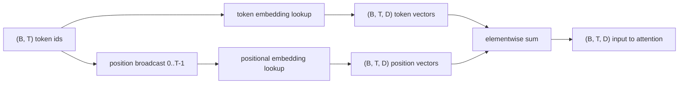
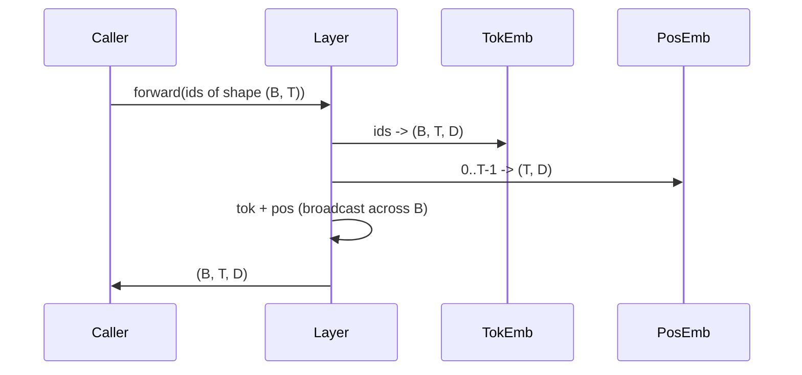

# Token and Positional Embeddings

> المعرفات هي أعداد صحيحة. النموذج يريد المتجهات. ويوجد بينهما جدولان للبحث، ويشكل اختيار الموضع ما يمكن أن يتعلمه النموذج.

**النوع:** بناء
** اللغات: ** بايثون
**المتطلبات الأساسية:** دروس المرحلة 04، دروس المرحلة 07 للمحولات، الدروس 30 و31 من هذه المرحلة
**الوقت:** ~90 دقيقة

## Learning Objectives
- Build a token-embedding lookup table that maps vocabulary ids to dense vectors.
- Build a learned positional-embedding lookup table indexed by position.
- Build a fixed sinusoidal positional embedding indexed by position with no parameters.
- Compose token and positional embeddings into a single input for a transformer block.
- Contrast learned and sinusoidal embeddings on length generalization and parameter count.

## The frame

أول اتصال للنموذج بمعرف الرمز المميز هو البحث عن صف في مصفوفة تضمين الرمز المميز. تحتوي المصفوفة على صف واحد لكل معرف مفردات وعمود واحد لكل بُعد نموذج. يُرجع البحث متجهًا يعامله باقي النموذج على أنه معنى المعرف. يقوم Backprop بتحديث الصفوف التي تم استخدامها في التمرير الأمامي. ومن خلال التدريب، تتعلم هندسة تلك الصفوف كيفية تشفير التشابه في الاتجاهات.

معرفات الرمز المميز وحدها ليس لها ترتيب. يحتاج النموذج إلى إشارة ثانية تخبره بأن الموضع الأول يختلف عن الموضع السابع عشر. الخياران السائدان لهذه الإشارة هما التضمين الموضعي المكتسب (جدول بحث ثانٍ، صف واحد لكل موضع) والتضمين الموضعي الجيبي الثابت (صيغة رياضية بدون معلمات). الاختيار له عواقب. الجدول الذي تم تعلمه هو معلمة ويحده الحد الأقصى لطول السياق الذي تم تدريب النموذج عليه. الجدول الجيبي خالي من المعلمات من الناحية النظرية وتمتد الصيغة إلى أي موضع، ولكن `SinusoidalPositionalEmbedding` في هذا الدرس يحسب مسبقًا جدولًا ثابتًا عند `max_context_length` ويرتفع `forward` بعد هذا الحد؛ وبالتالي فإن كلتا الوحدتين تفرضان الحد الأقصى لطول السياق هنا. قد لا يزال النموذج يواجه صعوبة في تجاوز مدة التدريب حتى عندما يكون الجدول كبيرًا بما يكفي للفهرسة.

يقوم هذا الدرس ببناء كليهما وتأليفهما مع تضمين الرمز المميز في إدخال واحد لكتلة انتباه الدرس التالي.

## The shape contract

الإدخال إلى مرحلة التضمين عبارة عن مجموعة من معرفات الرموز المميزة بالشكل `(B, T)`. الناتج عبارة عن موتر للشكل `(B, T, D)` حيث `D` هو بُعد النموذج. كل عنصر دفعي له نفس طول السياق `T`. كل موضع له نفس البعد المتجه `D`.



والتركيب عبارة عن مجموع وليس سلسلة. يُبقي الجمع `D` ثابتًا عبر الشبكة ويتيح للنموذج أن يقرر على أساس كل ميزة ما إذا كان معنى الرمز المميز أو الموضع هو المهيمن في كل طبقة.

## The token embedding matrix

تضمين الرمز المميز هو موتر معلمة للشكل `(V, D)` حيث `V` هو حجم المفردات. PyTorch يعرضه كـ `nn.Embedding(V, D)`. في البداية، يتم استخلاص الإدخالات من Gaussian صغير، تقليديًا بمتوسط ​​صفر وانحراف معياري حول `0.02` لنماذج مقياس المحولات. الحرف الأول الدقيق أقل أهمية من أنه يظل ثابتًا عبر عمليات التشغيل.

التمريرة الأمامية هي عملية فهرسة واحدة. PyTorch يقوم بتعيين `(B, T)` معرفات int64 إلى `(B, T, D)` من خلال تجميع الصفوف. يقوم التمرير الخلفي بتجميع التدرجات فقط في الصفوف التي تم لمسها في التمرير الأمامي. يتلقى الصفان اللذان لم يظهرا مطلقًا في الدُفعة تدرجًا صفريًا في تلك الخطوة.

تفاصيل دقيقة. غالبًا ما يتشارك تضمين الرمز المميز وإسقاط الإخراج في نهاية النموذج في الأوزان (ربط الوزن). عندما يحدث ذلك، فإن كل تمريرة للخلف تمس كل صف من التضمين عبر جانب الإخراج. يكشف الدرس هنا عن كليهما كوحدات منفصلة ولكن يمكن للمصفوفة نفسها أن تلعب كلا الدورين في نموذج كامل.

## The learned positional embedding

التضمين الموضعي الذي تم تعلمه هو `nn.Embedding` ثانية من الشكل `(max_context_length, D)`. يتم إجراء البحث بواسطة معرف الموضع `0, 1, 2,..., T-1`. يبث التمرير الأمامي متجه الموضع عبر بُعد الدُفعة.

الجانب السلبي للجدول الذي تم تعلمه هو أنه لا يمكن الاستعلام عنه في الموضع `T` إذا تم تدريب النموذج حتى الموضع `T-1` فقط. الصف غير موجود. تعمل نماذج وحدة فك ترميز الإنتاج فقط التي تستخدم هذا المخطط على حجب الحد الأقصى لطول السياق في البنية وترفض معالجة المدخلات الأطول.

## The sinusoidal positional embedding

التضمين الموضعي الجيبي هو وظيفة من الموضع إلى المتجه. الموضع `p` والميزة `i` المنتج

```python
angle = p / (10000 ** (2 * (i // 2) / D))
emb[p, 2k]     = sin(angle)
emb[p, 2k + 1] = cos(angle)
```

لا تحتوي الدالة على معلمات. كل موقف له ناقل فريد من نوعه. يختلف الطول الموجي هندسيًا عبر أبعاد الميزة، لذا فإن الأبعاد السفلية تشفر الموضع الخشن والأبعاد الأعلى تشفر الموضع الدقيق.

الخاصية التي تتبع اختيار `sin` و `cos` معًا هي أن المتجه عند الموضع `p + k` هو دالة خطية للمتجه عند الموضع `p`. وهذا يمنح طبقة الانتباه مسارًا سهلاً لتعلم إزاحات الموضع النسبي. لا يحتاج النموذج إلى معلمة منفصلة للتعبير عن "النظر إلى خمسة رموز مميزة".

يحسب الدرس الجدول الجيبي الكامل مرة واحدة عند الإنشاء ويفهرسه في وقت لاحق.

## The composition

الإدخال pipeline يقوم بثلاثة أشياء بالترتيب. قراءة معرفات الرمز المميز. ابحث عن ناقلات الرمز المميز. أضف المتجهات الموضعية. إرجاع المبلغ.



يقوم البث في خطوة المجموع بتكرار الموتر الموضعي `(T, D)` على طول بُعد الدُفعة. PyTorch يتعامل مع ذلك تلقائيًا لأن الموتر الموضعي له شكل `(1, T, D)` بعد فك الضغط.

## Contrastive analysis

يقوم الدرس بتشغيل كلا المتغيرين على نفس المدخلات ويطبع تشخيصين.

الأول هو عدد المعلمات. يضيف المتغير الذي تم تعلمه معلمات `max_context_length * D` أعلى تضمين الرمز المميز. يضيف المتغير الجيبي صفرًا.

والثاني هو تشابه جيب التمام بين التضمين في المواضع المجاورة. المتغير الجيبي لديه اضمحلال سلس ويمكن التنبؤ به لأن الوظيفة مستمرة. يحتوي المتغير الذي تم تعلمه عند التهيئة على تشابه شبه عشوائي لأن الصفوف يتم رسمها بشكل مستقل. بعد التدريب، عادةً ما يطور المتغير المتعلم بنية سلسة مماثلة، ولكن يجب عليه اكتشاف هذه البنية من البيانات.

## What this lesson does not do

لا يقوم ببناء التشفير الموضعي الدوار (RoPE) أو AliBi. تلك هي الاختيارات الحديثة في محولات الإنتاج. كلاهما يتبعان نفس عقد الشكل مثل التضمينات هنا (تطبيق تحويل يعتمد على الموضع على متجهات الشكل `(B, T, D)`) ولكنهما ينطبقان على خطوة إسقاط الانتباه بدلاً من الإدخال. الدرس التالي يبني كتلة الانتباه، وأحد الامتدادات الاختيارية هو طي الدوارة في إسقاطات مفتاح الاستعلام هناك.

لا يقوم بتدريب التضمين. يتطلب التدريب خسارة، الأمر الذي يتطلب إخراج نموذج، الأمر الذي يتطلب الاهتمام ورأس LM. وهذا هو الدرس التالي والذي بعده.

## How to read the code

`main.py` يحدد ثلاث وحدات. `TokenEmbedding` يلتف `nn.Embedding(V, D)`. `LearnedPositionalEmbedding` يلتف `nn.Embedding(L, D)`. `SinusoidalPositionalEmbedding` يحسب الجدول مسبقًا ويعرضه كمخزن مؤقت. `EmbeddingComposer` يربط بين تضمين الرمز المميز والتضمين الموضعي معًا. يقوم العرض التوضيحي الموجود في الأسفل بطباعة الأشكال وعدد المعلمات وتشخيص تشابه موضع الجوار. الاختبارات في شكل الدبوس `code/tests/test_embeddings.py` وسلوك البث وعدد المعلمات والصيغة الجيبية.

قم بتشغيل العرض التوضيحي. ثم قم بتغيير بُعد النموذج `D` من 64 إلى 32 وشاهد كيف تتغير نطاقات الطول الموجي الجيبية.
