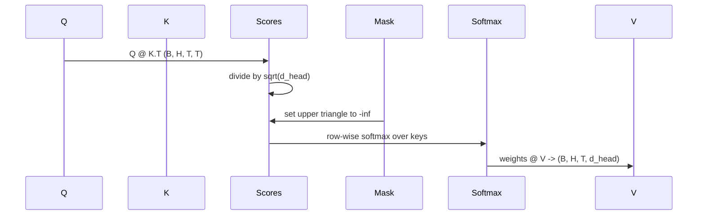

# Multi-Head Self-Attention

> إسقاط خطي واحد، ثلاث مناظر، رؤوس متوازية على شكل حرف H، قناع واحد. كتلة الانتباه حيث يستخدمها النموذج بالفعل.

**النوع:** بناء
** اللغات: ** بايثون
**المتطلبات الأساسية:** دروس المرحلة 04، دروس المرحلة 07 للمحولات، الدروس من 30 إلى 32 من هذه المرحلة
**الوقت:** ~90 دقيقة

## Learning Objectives
- Implement a batched Query/Key/Value projection as a single linear layer split into H heads.
- Compute scaled dot-product attention with the correct normalization and dtype handling.
- Apply a causal mask that prevents a position from attending to future positions.
- Inspect per-head attention weights for a fixed input and reason about what each head looks at.
- Train a small attention block on a toy task and watch the loss fall as the heads specialize.

## The frame

الانتباه هو الوظيفة التي تسمح لتمثيل الرمز المميز بسحب المعلومات من الرموز المميزة الأخرى بنفس التسلسل. الاهتمام الذاتي يعني أن الاستعلامات والمفاتيح والقيم كلها مستمدة من نفس المدخلات. الرؤوس المتعددة تعني أن الإسقاط مقسم إلى مشاكل انتباه متوازية على شكل H تكون مخرجاتها متسلسلة ويتم إسقاطها مرة أخرى.

نمط التنفيذ الفعال عبارة عن طبقة خطية واحدة يتم عرضها من `D` إلى `3 * D` ويتم تقسيمها إلى ثلاث طرق عرض، ثم يتم إعادة تشكيلها إلى رؤوس H بحجم `D // H` لكل منها. يحدث الماتمول والسوفت ماكس والمجموع المرجح كعمليات موتر مجمعة بحيث تعمل الرؤوس بالتوازي على المسرع.

هذا الدرس يبني تلك الكتلة. كما أنه يضيف القناع السببي بحيث يعمل نفس الكود كطبقة الانتباه في نموذج لغة وحدة فك التشفير فقط. الدرس التالي يجمع الكتلة في محول كامل والدرس الذي يليه يدربها.

## The shape contract

الإدخال هو `(B, T, D)`. الناتج هو `(B, T, D)`. القناع `(T, T)` أو قابل للبث إليه. داخل الكتلة يكون للموترات المتوسطة شكل `(B, H, T, d_head)` حيث `d_head = D // H`. القيد هو `D % H == 0`.

```mermaid
flowchart LR
    A["(B, T, D) input"] --> B[Linear D -> 3D]
    B --> C["split into Q, K, V"]
    C --> D["reshape to (B, H, T, d_head)"]
    D --> E["scores = Q @ K.T / sqrt(d_head)"]
    E --> F[apply causal mask]
    F --> G[softmax over keys]
    G --> H["context = weights @ V"]
    H --> I["reshape to (B, T, D)"]
    I --> J[output Linear D -> D]
    J --> K["(B, T, D) output"]
```

الطبقتان الخطيتان (إسقاط QKV وإسقاط الإخراج) هما المعلمتان الوحيدتان في الكتلة. القناع و softmax و matmuls و reshapes كلها خالية من المعلمات.

## The QKV split

يحتوي التنفيذ الساذج على ثلاث طبقات خطية منفصلة، ​​واحدة لكل من Q وK وV. وتشتمل الطبقة الفعالة على طبقة واحدة تنتج ميزات `3 * D` وتقسم النتيجة. الاثنان متكافئان رياضيًا لأن ثلاثة مضاعفات مصفوفة منفصلة بأوزان `(D, D)` هي بالضبط ضرب مصفوفة واحدة بوزن `(3D, D)` مكدسة منها.

الإصدار الفعال أسرع لأن المسرع يطلق ماتمول واحد بدلاً من ثلاثة. من الأسهل أيضًا التهيئة لأن المصفوفات الفرعية الثلاث تعيش في نفس موتر المعلمة ويمكن تهيئتها معًا.

## The head reshape

بعد التقسيم، كل من Q، K، V هو `(B, T, D)`. لتحويل ذلك إلى مشاكل انتباه متوازية H، نعيد التشكيل إلى `(B, T, H, d_head)` وننقله إلى `(B, H, T, d_head)`. يقع بُعد الرأس الآن بجوار بُعد الدُفعة، لذا يتعامل PyTorch مع الاهتمام لكل رأس كعملية مجمعة عبر `B * H` مثيلات مستقلة.

يظل البعد d_head أخيرًا لذا فإن النتيجة `Q @ K.transpose(-2, -1)` تتقلص عليه. والنتيجة هي `(B, H, T, T)` نقاط الاهتمام لكل رأس.

## Scaling

يتم تقسيم الدرجات على `sqrt(d_head)` قبل softmax. بدون هذا القياس، تنمو المنتجات النقطية مع نمو `d_head` وتدفع softmax إلى نظام حيث يحتوي أحد الإدخالات على الكتلة بأكملها تقريبًا بينما تكون الإدخالات الأخرى صغيرة إلى حد التلاشي. التدرجات في هذا النظام صغيرة وأكشاك التعلم. القسمة على `sqrt(d_head)` تحافظ على ثبات تباين الدرجات تقريبًا عبر أحجام الرأس.

## The causal mask

يمكن لنموذج اللغة المخصص لوحدة فك التشفير فقط أن يعتمد فقط على الماضي عند التنبؤ بالرمز المميز التالي. القناع يفرض ذلك. بشكل ملموس، قبل softmax، يتم استبدال كل إدخال فوق قطري مصفوفة النتيجة `(T, T)` بما لا نهاية سالبة. بعد softmax تحصل تلك الأوضاع على وزن صفر.

نقوم بتسجيل القناع كمخزن مؤقت عند الإنشاء بحيث يعيش على نفس جهاز النموذج وليس جزءًا من الرسم البياني المتدرج. يغطي القناع الحد الأقصى لطول السياق الذي ستشاهده الكتلة على الإطلاق. في الوقت الأمامي، نقوم بتقطيع الزاوية العلوية اليسرى `(T, T)`.

## The output projection

بعد متجهات السياق لكل رأس `(B, H, T, d_head)`، ننتقل مرة أخرى إلى `(B, T, H, d_head)`، ونعيد التشكيل إلى `(B, T, D)`، ونطبق إسقاطًا خطيًا نهائيًا `(D, D)`. يتيح إسقاط الإخراج للنموذج مزج الرؤوس. بدونها، لن يتم إعادة تجميع رؤوس H إلا من خلال طبقات لاحقة وستكون الكتلة مقيدة بشكل مصطنع.

## Attention weight inspection

يعرض الدرس علامة `return_weights=True` على التمريرة الأمامية. عند التعيين، تقوم الكتلة بإرجاع أوزان الانتباه لكل رأس للشكل `(B, H, T, T)` بجانب الإخراج. يطبع العرض التوضيحي خريطة حرارية لأوزان رأس واحد على مدخلات قصيرة حتى تتمكن من رؤية هيكل المثلث السببي والتركيز لكل موضع.

في النموذج المدرب، تتعلم الرؤوس المختلفة أنماطًا مختلفة. يهتم بعض الرؤساء بالرمز السابق مباشرة. يحضر بعض الرؤساء بداية التسلسل. تنشر بعض الرؤوس الانتباه بشكل موحد تقريبًا. خطاف الفحص هو نقطة الدخول لعمل القابلية للتفسير.

## The training demo

يقوم العرض التوضيحي الموجود أسفل `main.py` بتوصيل كتلة الانتباه إلى رأس LM صغير ويدرب كل شيء على مهمة متكررة. كل صف من المدخلات عبارة عن معرف عشوائي واحد يتم نسخه عبر السياق. الهدف هو أن يتم إزاحة المدخل بمقدار واحد، لذلك يجب أن يتعلم النموذج أن الرمز المميز التالي هو نفس الرمز المميز السابق. الخسارة هي الانتروبيا المتقاطعة. مع H=4، D=32، T=12، ومفردات 64، تنخفض الخسارة من عشوائي (حوالي `log(64) ~ 4.16`) إلى أقل من `1.0` على مدى ثلاث فترات في CPU.

الهدف من العرض التوضيحي ليس تدريب نموذج مفيد. الهدف هو التأكد من تدفق التدرجات عبر كل قطعة من الكتلة ويتعلم الرؤوس شيئًا ما حول مشكلة تكون الإجابة واضحة فيها.

## What this lesson does not do

لا يضيف كتلة تغذية للأمام. طبقة المحولات في النموذج الحقيقي هي طبقة الاهتمام تليها طبقتين MLP مع اتصال متبقي وقاعدة طبقة حول كل منهما. الدرس التالي يضيف تلك.

لا يطبق التشفير الموضعي أو التشفير الموضعي AliBi. كلاهما ينطبق على خطوة الإسقاط QKV في نفس الكتلة، لكنهما وحدة تعليمية منفصلة. الكتلة كما بنيت هنا متوافقة مع أي منهما عن طريق تحويل Q و K قبل matmul.

لا يطبق KV ذاكرة التخزين المؤقت للاستدلال. يعد التخزين المؤقت للمفاتيح والقيم عبر التمريرات الأمامية هو التحسين الذي يعمل على فك تشفير الانحدار التلقائي بسرعة make. إنه يغير عقد الشكل على موتر K و V ولكن ليس على Q. إنه ينتمي إلى درس الاستدلال.

## How to read the code

`main.py` يحدد `MultiHeadSelfAttention`. تحتوي الفئة على طبقتين خطيتين ومخزن مؤقت للقناع المسجل. تقوم التمريرة الأمامية بمشاريع، وإعادة تشكيل، وتسجيل، وأقنعة، وsoftmaxes، وأوزان، وإعادة تشكيل، ومشروعات مرة أخرى. يبني العرض التوضيحي في الأسفل نموذجًا صغيرًا يلفت الانتباه بالتضمينات الرمزية والموضعية ورأس LM، ويدربه على مهمة نسخ لمدة ثلاث حقب، ويطبع منحنى الخسارة وخريطة حرارة الانتباه لكل رأس. تثبت الاختبارات الموجودة في `code/tests/test_attention.py` عقد الشكل، وخاصية السببية، وخاصية softmax، وخاصية تقسيم الرأس، وتدفق التدرج.

قم بتشغيل العرض التوضيحي. ثم قم بزيادة `n_heads` من 4 إلى 8 (مع الاحتفاظ بـ `d_model=32`، وبالتالي `d_head=4`) وشاهد تغير الخريطة الحرارية.
