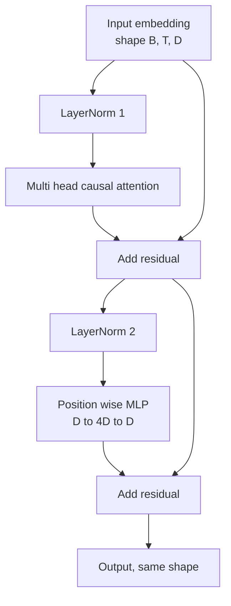
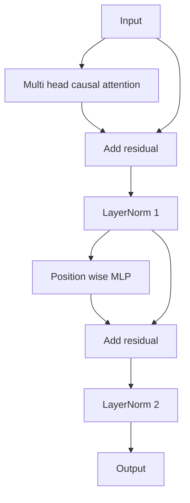

# Transformer Block from Scratch

> الكتلة الواحدة هي وحدة كل جهاز فك تشفير حديث LLM. معيار الطبقة، انتباه الرؤوس المتعددة، المتبقي، MLP، المتبقي. يتدرب الإصدار السابق LN بثبات دون إحماء. متغير ما بعد LN هو ما تم شحنه بالورقة الأصلية. يبني هذا الدرس كليهما، جنبًا إلى جنب، ويوضح أي واحدة منهما ستنجو من كومة مكونة من 12 طبقة بمعدلات تعلم مشتركة.

**النوع:** بناء
** اللغات: ** بايثون
**المتطلبات الأساسية:** دروس المرحلة 19 من 30 إلى 33 (أداة الرمز المميز، والتضمينات، ورياضيات الانتباه، ومحمل البيانات المجمعة)
**الوقت:** ~90 دقيقة

## Learning Objectives

- قم ببناء كتلة محولات في PyTorch من القطع المتحركة الأربعة: LayerNorm، الانتباه السببي متعدد الرؤوس، الوصلات المتبقية، الموضع الحكيم MLP.
- ضع LayerNorms في تكوينين (ما قبل LN وما بعد LN) واشرح لماذا يتدرب الشخص بثبات دون إحماء.
- قم بتنفيذ الإخفاء السببي داخل انتباه الرؤوس المتعددة بحيث لا يتمكن الرمز المميز `i` من رؤية الرموز المميزة `j > i`.
- تتبع تدفق التدرج من خلال كلا الخيارين على مجموعة مكونة من 12 طبقة واقرأ النتيجة دون التلويح باليد.
- أعد استخدام الكتلة كوحدة إضافية عندما يجمع الدرس التالي معلمة 124 مليون GPT.

## The Problem

المحول عبارة عن كتلة واحدة متكررة. أخطأ في صياغة الكتلة مرة واحدة، ثم كررها اثنتي عشرة مرة، وستقوم بشحن نموذج يتباين في العصر الأول أو يحتاج إلى عمليات إحماء في بقية الطريق. إن وضعي الفشل اللذين ستشاهدهما في هذا الدرس ليسا غريبين. تظهر في المرة الأولى التي يقوم فيها المتعلم بتكديس الكتل بسذاجة. الأول هو طبقة الاهتمام التي تحضر للمستقبل. والآخر هو LayerNorm الذي يتم وضعه حيث لا يمكنه ترويض الإشارة المتبقية في العمق.

الإصلاح ميكانيكي بمجرد رؤيته. تحتوي الكتلة على مسارين متبقيين بالضبط وموضعين للتطبيع بالضبط. اختر المواضع بشكل صحيح وبقية المكدس هو مجرد مسك الدفاتر.

## The Concept

كل كتلة محول وحدة فك ترميز فقط هي وظيفة تأخذ موترًا بالشكل `(batch, sequence, embedding)` وترجع موترًا بنفس الشكل. في الداخل، هناك طبقتان فرعيتان تقومان بهذا العمل.



هذا هو البديل ما قبل LN. يقع LayerNorm داخل الفرع المتبقي، قبل الطبقة الفرعية. يحمل الاتصال المتبقي الإشارة غير الطبيعية إلى الأمام.

يقوم متغير ما بعد LN بنقل LayerNorm إلى ما بعد الإضافة المتبقية.



الشكل متطابق. سلوك التدريب ليس كذلك. مع ما بعد LN، يجب أن يمر التدرج الذي يتدفق مرة أخرى عبر المسار المتبقي عبر LayerNorm. عند العمق اثني عشر ومعدل التعلم `3e-4`، يتقلص هذا التدرج بسرعة كافية ليحتاج إلى جدول تدريب. يترك LN المسار المتبقي غير طبيعي، لذلك تنتشر التدرجات بشكل نظيف إلى طبقة التضمين. Pre-LN هو التكوين GPT-2 الذي يتم شحنه لاحقًا لهذا السبب.

### Causal multi head attention

تعرض الطبقة الفرعية للانتباه الإدخال بثلاث طرق في موترات الاستعلام والمفتاح والقيمة. تمت إعادة تشكيل كل منها من `(B, T, D)` إلى `(B, H, T, D/H)` حيث `H` هو عدد الرؤوس. يحسب اهتمام المنتج النقطي المقياس `softmax(Q K^T / sqrt(d_k))` لكل رأس، ويخفي المثلث العلوي إلى اللانهاية السالبة، ويطبق القناع عبر softmax، ثم يضرب في `V`. يتم ربط الرؤوس مرة أخرى في موتر واحد `(B, T, D)` وإسقاطها مرة أخرى. القناع هو القطعة الوحيدة التي make هي النموذج السببي. انسى القناع وتدرب عارضة أزياء تغش.

### The MLP

يطبق الموضع MLP نفس الشبكة المكونة من طبقتين على كل رمز مميز بشكل مستقل. العرض المخفي هو أربعة أضعاف عرض التضمين، والتنشيط هو GELU، ويتبع التسرب الخطي الثاني. لا توجد رموز تتحدث مع بعضها البعض داخل MLP. كل خلط الرموز يحدث في الاهتمام.

### Residual connections do two things

إنهم make مسار التدرج الإضافي عبر العمق، والذي يحافظ على معيار التدرج في الحجم من خلال اثنتي عشرة طبقة. كما أنها تسمح لكل كتلة بتعلم تحديث إضافي للإصدار قيد التشغيل بدلاً من الاستبدال الكامل. كلا التأثيرين هما سبب جداول الكتلة.

## Build It

`code/main.py` ينفذ:

- `class LayerNorm` بمقياس قابل للتعلم وإزاحة، eps متحيز، يتم تطبيقه لكل متجه رمزي.
- `class MultiHeadAttention` مع `num_heads`، `head_dim = d_model // num_heads`، إسقاط QKV مدمج، قناع سببي مسجل، الانتباه والتسرب المتبقي.
- `class FeedForward` بطبقتين خطيتين، GELU التنشيط، التسرب.
- `class TransformerBlock` مع علامة `pre_ln` للتبديل بين المتغيرين.
- عرض توضيحي يبني مكدسًا مكونًا من 6 طبقات قبل LN ومكدسًا مكونًا من 6 طبقات بعد LN بمدخلات ومطبوعات متطابقة (أ) شكل الإخراج، (ب) معيار التدرج عند التضمين بعد تمريرة خلفية واحدة.

تشغيله:

```bash
python3 code/main.py
```

الإخراج: التحقق من الشكل على كلا المجموعتين، ومعايير التدرج جنبًا إلى جنب. يكون تدرج تضمين المكدس قبل LN أكبر من حجم مكدس ما بعد LN بنفس معدل التعلم، وهو الإشارة التجريبية التي تتدرب قبل LN بدون إحماء.

## Stack

- `torch` لرياضيات الموتر، والتسجيل التلقائي، و `nn.Module` للسباكة.
- لا `transformers`، لا أوزان مدربة مسبقاً. يتم تنفيذ الكتلة من البدائيين.

## Production patterns in the wild

ثلاثة أنماط تحول كتلة الكتاب المدرسي إلى شيء يمكنك شحنه.

**إسقاط QKV منصهر.** ثلاث طبقات خطية منفصلة تكلف ثلاث عمليات إطلاق نواة وثلاثة ماتمول. تقوم طبقة خطية واحدة بعرض `3 * d_model` بنفس العمل في عملية إطلاق واحدة، ثم تقوم بتقسيم الإخراج على طول المحور الأخير. يكون المسار المدمج أسرع في كل مسرع ويطابق التطبيقات المرجعية لـ GPT-2 وLLaMA وMistral التي يتم شحنها جميعًا.

** المخزن المؤقت للقناع السببي المسجل. ** يعتمد القناع فقط على الحد الأقصى لطول السياق. قم بتخصيصه مرة واحدة عند الإنشاء باستخدام `register_buffer`، وقم بتقسيم النافذة النشطة لكل تمريرة أمامية، وتخطي التخصيص لكل مكالمة. يؤدي نسيان هذا إلى تحويل القناع إلى نقطة تخصيص فعالة في سياق طويل.

**التسرب في مكانين وليس ثلاثة.** التسرب ينتمي بعد انتباه softmax (تسرب الانتباه) وبعد الخط الثاني من MLP (التسرب المتبقي). يؤدي التسرب من المادة المتبقية إلى كسر الهوية المضافة التي تسمح بتدفق التدرج في العمق. لقد أخطأت بعض التطبيقات المبكرة في هذا الأمر ودفعت ثمنها من خلال التدريب الهش.

## Use It

- يتم توصيل الكتلة الموجودة في هذا الدرس مباشرة بمجموعة GPT في الدرس 35 بدون تعديل.
- البديل السابقLN هو ما تستخدمه كل الأوزان المفتوحة الحديثة LLM. متغير ما بعد LN هو ما استخدمته ورقة الاهتمام الأصلية لعام 2017. إن معرفة كليهما تكفي لقراءة أي بنية وحدة فك ترميز ستواجهها.
- استبدل GELU بـ SiLU وستحصل على تفعيل عائلة LLaMA. استبدل LayerNorm بـ RMSNorm وستحصل على تطبيع عائلة LLaMA. نفس الهيكل العظمي.

## Exercises

1. أضف علامة `bias=False` إلى كل خطي في الكتلة. الأوزان المفتوحة الحديثة LLMs السفينة بدون تحيزات على الطبقات الخطية. قم بقياس عدد المعلمات التي قمت بحفظها في نموذج خافت مكون من 12 طبقة 768.
2. استبدل `nn.LayerNorm` بـ RMSNorm ملفوف يدويًا وتأكد من عدم تغيير شكل الإخراج.
3. أضف علامة تُرجع أوزان الانتباه للرأس الأول كموتر `(B, T, T)`. ارسم المثلث العلوي للتأكد من أنه صفر بعد softmax.
4. قم بإنشاء فحص سلامة يغذي موتر `(2, 16, 384)` بـ `H=6` من خلال كلا المتغيرين ويؤكد أن المخرجات الأمامية مختلفة (على سبيل المثال، `not torch.allclose`) عندما تتم تهيئة الأوزان بشكل متطابق ويتم ضبط التسرب على الصفر.

## Key Terms

| مصطلح | ماذا يقول الناس | ماذا يعني في الواقع |
|------|-|---------------------------------------|
| ما قبل LN | "المعيار المسبق" | LayerNorm داخل الفرع المتبقي، قبل كل طبقة فرعية؛ يحمل المتبقي الإشارة غير الطبيعية |
| بوست-LN | "ما بعد القاعدة" | LayerNorm بعد الإضافة المتبقية؛ ما الذي شحنته ورقة 2017 وما الذي يحتاج إلى إحماء |
| القناع السببي | "قناع المثلث" | تم ضبط المثلث العلوي للانتباه logits على اللانهاية السالبة لذا لا يمكنني قراءة الرمز المميز j عندما يكون j أكبر من i |
| منصهر QKV | "الإسقاط المشترك" | خطي واحد بعرض ثلاثي الأبعاد بدلاً من ثلاثة خطوط عرضية D؛ نواة واحدة، متمول واحد |
| الدفق المتبقي | "تخطي الاتصال" | الموتر غير الطبيعي الذي يتدفق من الأعلى إلى الأسفل عبر كل كتلة؛ ما تضيفه كل كتلة إلى |

## Further Reading

- المرحلة السابعة الدرس 02 (الانتباه الذاتي من الصفر) لرياضيات الانتباه الموجودة أسفل هذه الكتلة.
- المرحلة السابعة الدرس 05 (المحول الكامل) لنسخة فك التشفير لنفس الهيكل.
- المرحلة 10 الدرس 04 (التدريب المسبق المصغر GPT) لإجراءات التدريب التي يتم توصيل هذه الكتلة بها.
- المرحلة 19 الدرس 35 (هذا المسار) الذي يجمع اثني عشر من هذه الكتل في نموذج GPT.
