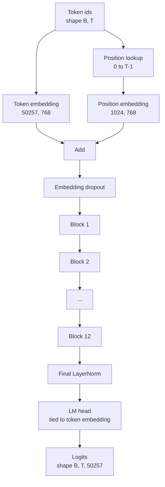
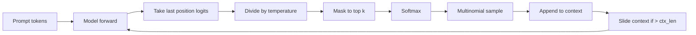

# GPT Model Assembly

> اثنتا عشرة كتلة مكدسة، وتضمين رمز مميز، وتضمين موضع مكتسب، وLayerNorm نهائي، ورأس نموذج لغة مرتبط. هذا هو نموذج المعلمة 124 مليون GPT بالكامل. يجمع هذا الدرس هذه القطع في فئة عمل، ويحسب المعلمات للتأكد من تطابق النموذج مع الشكل المرجعي 124M، ويولد نصًا بأخذ عينات متعددة الحدود، ودرجة الحرارة، وأعلى k.

**النوع:** بناء
** اللغات: ** بايثون
**المتطلبات:** المرحلة 19 الدروس من 30 إلى 34
**الوقت:** ~90 دقيقة

## Learning Objectives

- قم بتجميع كتلة المحول من الدرس 34 إلى نموذج GPT كامل: تضمين الرمز المميز، تضمين الموضع، كتل N، LayerNorm النهائي، رأس نموذج اللغة.
- إعادة إنتاج تكوين المعلمة البالغ عدده 124 مليونًا: المفردة 50257، السياق 1024، التضمين 768، اثني عشر رأسًا، واثنتي عشرة طبقة.
- اربط أوزان رأس نموذج اللغة بتضمين الرمز المميز واشرح سبب توفير حوالي 38 مليون معلمة على هذا المقياس.
- قم بإنشاء نص من موجه باستخدام أخذ عينات متعددة الحدود، وقياس درجة الحرارة، واقتطاع الجزء العلوي، مع الاحتفاظ بطول السياق باستخدام نافذة منزلقة.
- قياس عدد المعلمات وتكلفة التمريرة الأمامية مقابل هدف 124 مليونًا.

## The Problem

كتلة المحولات لا تفعل شيئًا من تلقاء نفسها. تحتاج إلى تحويل معرفات الرموز المميزة إلى متجهات، وخلط المعلومات الموضعية، وتشغيلها عبر المكدس، وإسقاطها مرة أخرى على المفردات الصغيرة. انسَ أيًا من هذه الخطوات الأربع، وسيفشل النموذج في التقدم للأمام، أو ينجرف في معلومات الموقع، أو لا يستطيع التحدث.

شكل النموذج مهم أيضًا. المرجع GPT-2 صغير هو 124 مليون معلمة بالتكوين أعلاه بالضبط. الأرقام ليست سحرية. Vocab 50257 مرات التضمين 768 هو جدول الرموز المميزة. الموضع 1024 ضرب 768 هو جدول الموضع. اثني عشر كتلة في ما يقرب من 7 ملايين معلمة لكل منها 84 مليونًا. يعيد الرأس النهائي استخدام جدول الرمز المميز عن طريق ربط الوزن. اجمع القطع وستصل إلى 124 مليونًا. إن إنشاء نموذج لا يتطابق عدد معلماته مع المرجع هو علامة على أنك قمت بتوصيل شيء خاطئ.

## The Concept



تصبح معرفات الرمز المميز ناقلات رمزية. تصبح معرفات الموضع متجهات للموضع. تتم إضافة الاثنين وإرسالهما عبر المكدس. إن LayerNorm النهائي هو القطعة الوحيدة خارج الكتل التي نجت من كل المتغيرات الحديثة. يعيد الرأس LM استخدام مصفوفة تضمين الرمز المميز، وهو ما يعنيه ربط الوزن.

### Weight tying

يحتوي تضمين الرمز المميز على الشكل `(vocab, d_model)`. يحتاج رأس نموذج اللغة إلى العرض من `d_model` إلى `vocab`. تلك هي منقولات لبعضها البعض. ربط الاثنين يعني حرفيًا نفس موتر المعلمة، يُستخدم مرتين. في المفردتين 50257 وd_model 768، تتكون المصفوفة من 38 مليون معلمة. غير مقيدة، تدفع ثمنها مرتين. مقيد، تدفع ثمنه مرة واحدة وستحصل أيضًا على إشارة تدرج أكثر وضوحًا قليلاً بسبب تحديث التضمين والرأس معًا.

### Position embedding is learned, not sinusoidal

GPT-2 يتم شحن موضع التضمين المكتسب. جدول الموضع عبارة عن موتر ذو معلمة واحدة للشكل `(1024, 768)`. يبحث النموذج عن الموضع من 0 إلى T-1 عند كل خطوة للأمام ويضيف البحث إلى تضمين الرمز المميز. هذا هو أبسط مخططات الموضع (RoPE، ALiBi، T5 التحيز النسبي هي البدائل) وهو ما يستخدمه المرجع 124M.

### Generation: temperature, top-k, multinomial

الجيل هو الانحدار الذاتي. في كل خطوة، يُرجع النموذج الحد الأدنى من المفردات الكاملة في كل موضع. أنت تأخذ الموضع الأخير فقط، وتقسم حسب درجة الحرارة، وتخفي كل شيء بشكل اختياري باستثناء أعلى k logits إلى اللانهاية السالبة، وsoftmax للحصول على الاحتمالات، وعينة رمزية واحدة من التوزيع الناتج.



ثلاثة مقابض، وثلاثة سلوكيات مختلفة. درجة الحرارة القريبة من الصفر تنهار إلى الجشع. درجة الحرارة الأولى تطابق التوزيع الطبيعي للنموذج. Top-k واحد جشع. يقوم Top-k fourty بتصفية الذيل الطويل. المجموعات مهمة. يستخدم الدرس التالي حول التدريب التوليد كإشارة تقييم نوعية.

## Build It

`code/main.py` ينفذ:

- `class GPTConfig` فئة البيانات مع الإعدادات الافتراضية 124M: `vocab_size=50257`، `context_length=1024`، `d_model=768`، `num_heads=12`، `num_layers=12`، `mlp_expansion=4`، `dropout=0.1`، `use_bias=True`، `weight_tying=True`.
- `class GPTModel` مع تضمين الرمز المميز، وتضمين الموضع، وتسرب التضمين، واثني عشر `TransformerBlock`s، وLayerNorm النهائي، و`lm_head` الذي يرتبط بتضمين الرمز المميز عند تعيين العلامة.
- مساعد `count_parameters` يُرجع عدد المعلمات الفريد (لذلك يتم احترام ربط الوزن في العدد).
- دالة `generate` تقوم بضبط درجة الحرارة، وأعلى k، ومتعددة الحدود، وسياق النافذة المنزلقة.
- عرض توضيحي لبناء النموذج، وطباعة عدد المعلمات بجوار المرجع 124M، وإنشاء تسلسل قصير من موجه ثابت لإظهار الخط pip ينتهي إلى النهاية.

تشغيله:

```bash
python3 code/main.py
```

الإخراج: عدد المعلمات جنبًا إلى جنب مع مرجع 124M، ومعرفات الرموز المميزة التي تم إنشاؤها من موجه عشوائي، وتأكيد على أن تخزين الرأس والرمز المميز LM يشترك في التخزين عند تشغيل الربط.

للحفاظ على سرعة العرض التوضيحي، يقوم البرنامج النصي أيضًا بتشغيل تكوين صغير (`d_model=64`، `num_layers=2`) من النهاية إلى النهاية وطباعة تسلسل الرمز المميز الذي تم إنشاؤه بشكل مضمن. تم إنشاء تكوين 124M ولكن يتم ممارسة عدد المعلمات وتمريرة أمامية واحدة فقط.

## Stack

- `torch` لرياضيات الموتر والتسجيل الذاتي والسباكة النمطية.
- `code/main.py` يعيد تنفيذ نفس نمط الكتلة من الدرس 34 محليًا.

## Production patterns in the wild

ثلاث أنماط make الفرق بين الموديل الذي يركض والموديل الذي يشحن.

** تهيئة الإسقاطات المتبقية صغيرة. ** يتم تغذية الإسقاط الناتج للانتباه والخط الثاني لـ MLP مباشرة في الإضافة المتبقية. إن تهيئة تلك التي لها نفس الانحراف المعياري مثل كل خطي آخر يعطي تيارًا متبقيًا ينمو بعمق ويدفع LayerNorm النهائي إلى نظام ساخن. قم بقياس المعيار بمقدار `1 / sqrt(2 * num_layers)` لهذين الإسقاطين؛ يبقى التيار المتبقي في نطاق معقول من خلال اثنتي عشرة طبقة.

**قم بتخزين موتر معرف الموضع مؤقتًا، لا تقم بإعادة الحساب.** `torch.arange(T)` يخصص ذاكرة جديدة عند كل هجوم. قم بالتخصيص مرة واحدة في `__init__` للحد الأقصى للسياق، وقم بتقسيم إدخالات T الأولى لكل مكالمة، وتخطي المُخصص ذهابًا وإيابًا.

**اربط الأوزان على مستوى المعلمة، وليس فقط عن طريق النسخ.** الإعداد `lm_head.weight = token_embedding.weight` يشارك الموتر؛ النسخ لا. يحتاج المُحسِّن إلى تحديث معلمة واحدة ويحتاج الرسم البياني التلقائي إلى تراكم واحد. إذا قمت بالتقليد، فإن الرأس ينحرف بعيدًا عن التضمين ولن يشتري لك ربط الوزن شيئًا.

## Use It

- الحصة النموذجية في هذا الدرس هي نفس شكل الحصة التي يدربها الدرس التالي.
- استبدال وضع التضمين المكتسب بـ RoPE يمنحك عائلة LLaMA دون لمس الكتلة أو الرأس.
- يؤدي استبدال GELU بـ SiLU وLayerNorm بـ RMSNorm إلى الحصول على بقية تغييرات عائلة LLaMA.
- وظيفة التوليد تعمل مع أي مصدر logits وليس هذا الموديل فقط. يمكنك سحب logits من ملف GPT-2 مُدرب مسبقًا في الدرس 37 وإعادة استخدام نفس حلقة التوليد.

## Exercises

1. قم بفك ربط الرأس LM من معلمات تضمين الرمز المميز وإعادة فرز الأصوات. تحقق من أن الدلتا هي 50257 ضرب 768 = 38 مليون.
2. استبدل موضع التضمين المكتسب بجدول جيبي محسوب في وقت البناء. قم بتأكيد استمرار تقدم النموذج وسيقل عدد المعلمات بمقدار 786,432.
3. أضف علامة `greedy=True` إلى الجيل الذي يتخطى أخذ العينات ويختار argmax. تأكد من أن التسلسل حتمي عبر التشغيل.
4. أضف مقبض `repetition_penalty` يقسم logit لأي رمز مميز في الموجه أو السجل الذي تم إنشاؤه بواسطة ثابت قبل softmax. أظهر في موجه ثابت أن القيم الأعلى من واحد تقلل من أعداد التكرار في الإخراج.
5. أضف `top_p` (النواة) لأخذ العينات بجوار `top_k`. تحقق من سطرين من أن مجموع احتمالات الرموز المميزة المحفوظة يتجاوز `top_p`.

## Key Terms

| مصطلح | ماذا يقول الناس | ماذا يعني في الواقع |
|------|-|---------------------------------------|
| ربط الوزن | "التضمينات المربوطة" | يشترك الرأس LM وتضمين الرمز المميز في نفس موتر المعلمة؛ يحفظ معلمات d_model مرات المفردات ويطابق المرجع GPT-2 |
| تضمين الموقف | "المواقف المستفادة" | تمت إضافة جدول شكل منفصل (طول السياق، d_model) إلى متجهات الرمز المميز؛ تعلمت نهاية إلى نهاية |
| سياق النافذة المنزلقة | "غطاء السياق" | عندما يتجاوز الموجه بالإضافة إلى الرموز المميزة التي تم إنشاؤها طول السياق، قم بإسقاط الرموز المميزة الأقدم بحيث تناسب النافذة النشطة |
| أخذ العينات من أعلى ك | "اقتطاع K" | احتفظ بـ K logits بأعلى القيم، وقم بإخفاء الباقي إلى اللانهاية السالبة، وsoftmax فوق الباقي |
| درجة الحرارة | "درجة حرارة أخذ العينات" | اقسم logits على T قبل softmax؛ T أقل من 1 يشحذ، T يساوي 1 يحافظ على التوزيع الطبيعي، T أكبر من 1 يسطح |

## Further Reading

- المرحلة 19 الدرس 34 للمكعب الذي يتم تكديسه في هذا النموذج.
- المرحلة 19 الدرس 36 لحلقة التدريب التي تقود هذا النموذج مع فقدان الإنتروبيا المتقاطعة.
- المرحلة 19 الدرس 37 لتحميل الأوزان GPT-2 المُدربة مسبقًا في هذه البنية الدقيقة.
- المرحلة السابعة الدرس 07 (GPT نمذجة اللغة السببية) لرياضيات التنبؤ بالرمز التالي.
- المرحلة 10 الدرس 04 (التدريب المسبق المصغر GPT) لإجراء التدريب الأصلي على نفس البنية.
