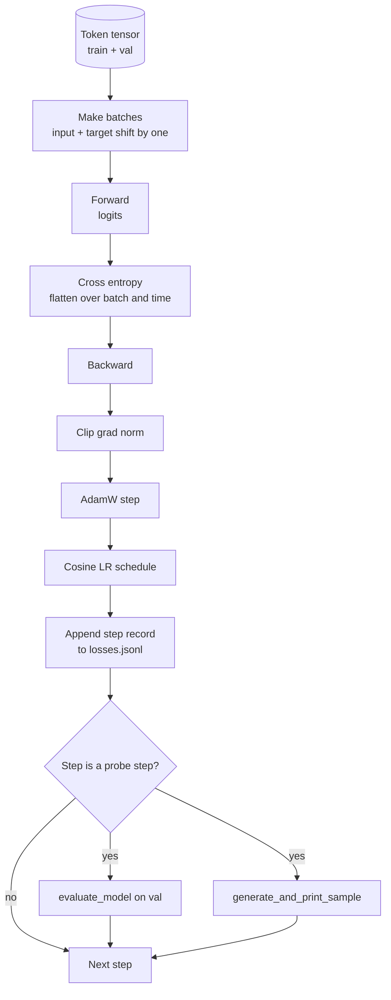

# Training Loop and Evaluation

> الحلقة التي لا تقاس هي حلقة تكذب. يبني هذا الدرس حلقة التدريب التي تقود نموذج GPT: AdamW مع تقسيم تناقص الوزن، وجدول معدل تعلم الإحماء وجيب التمام، ومساعد `calc_loss_batch`، وتمرير `evaluate_model` للبيانات المعلقة، ومسبار نوعي `generate_and_print_sample` في كل خطوة K، وسجل JSONL من الخسائر التي يمكنك التخطيط لها بعد ذلك. نفس الهيكل العظمي يدرب كل وحدة فك ترميز LLM ستبنيها على الإطلاق.

**النوع:** بناء
** اللغات: ** بايثون
**المتطلبات:** المرحلة 19 الدروس من 30 إلى 35
**الوقت:** ~90 دقيقة

## Learning Objectives

- أنشئ حلقة تدريب تحسب خسارة الإنتروبيا المتقاطعة باستخدام الإدخال الصحيح ومحاذاة الهدف للتنبؤ بالرمز المميز التالي.
- قم بتكوين AdamW مع تطبيق تسوس الوزن على موترات الوزن وليس على LayerNorm أو موترات التحيز.
- تنفيذ جدول معدل التعلم مع الإحماء الخطي واضمحلال جيب التمام، وقراءة الناتج LR مع مرور الوقت.
- قم بالتقييم على تقسيم معلق باستخدام `evaluate_model` بحيث تكون خسارة التقييم قابلة للمقارنة عبر عمليات التشغيل.
- قم بإنشاء عينة نوعية في كل خطوة K مع `generate_and_print_sample` لرصد التباعد قبل حدوث منحنى الخسارة.
- استمر في خسارة كل خطوة حتى JSONL حتى تتمكن من إعادة تحميل سجل التدريب وتخطيطه وشحنه كمخرج.

## The Problem

يفشل البرنامج النصي التدريبي الذي يطبع الخسارة ولكنه لا يفعل شيئًا آخر بثلاث طرق. لا يمكن أن يخبرك ما إذا كانت الخسارة تتناقص للسبب الصحيح (يمكن للنموذج أن يفرط في مجموعة التدريب ولا يتعلم أبدًا). لا يمكن أن يخبرك ما إذا كان الاختلاف قد بدأ (يمكن أن ترتفع الخسارة لخطوة واحدة ثم تتعافى، أو خطوة واحدة وتنهار). لا يمكن أن يخبرك بما تعلمه النموذج (الخسارة هي عددية، والعينة التي تم إنشاؤها هي فقرة). تختفي حالات الفشل الثلاثة ما لم يتم قياس الحلقة.

تقيس الحلقة في هذا الدرس ثلاث طرق. خسارة على دفعة التدريب في كل خطوة. خسارة الدفعة المعلقة في كل خطوة K. استمرار تم إنشاؤه من موجه ثابت في كل خطوة K. يقع سجل التدريب في JSONL لذا فإن القطعة الأثرية هي شهادة الحلقة.

## The Concept



القطعتان غير الواضحتين هما محاذاة الخسارة وانقسام AdamW.

### Loss alignment

يتنبأ النموذج بالرمز التالي في كل موضع. إذا كانت دفعة الإدخال عبارة عن رموز مميزة `[t0, t1, t2, t3]`، فيجب أن تكون الدفعة المستهدفة `[t1, t2, t3, t4]`. يتم حساب الإنتروبيا المتقاطعة على الشكل المسطح `(batch * seq, vocab)` مقابل الهدف المسطح `(batch * seq,)`. انسَ التحول وقم بتدريب النموذج على التنبؤ بنفسه، والذي يتقارب إلى خسارة صفر بينما لا يتعلم شيئًا مفيدًا.

### AdamW decay split

يؤدي تسوس الوزن إلى تنظيم موترات الوزن ولكن ليس مقاييس التطبيع أو التحيزات. يؤدي وضع الاضمحلال على مقياس LayerNorm إلى دفع المقياس ببطء إلى الصفر وكسر التطبيع. إن وضع التحلل على التحيز أمر غير ضار من الناحية الرياضية ولكنه مضيعة للدورات. التقسيم القياسي هو: الموترات ذات الشكل المصفوفي (الأوزان الخطية، جداول التضمين) تتحلل، وأي شيء يشبه المقياس أو الإزاحة لا يحدث ذلك.

### Warmup plus cosine schedule

تعمل عملية الإحماء على زيادة معدل التعلم من الصفر إلى الهدف عبر بضع مئات من الخطوات حتى يكون لدى حالة المحسن الوقت الكافي للتعبئة. يؤدي اضمحلال جيب التمام إلى خفض معدل التعلم مرة أخرى نحو الصفر خلال الخطوات المتبقية، وبالتالي تقوم المرحلة النهائية بضبط الأوزان بحجم خطوة صغير. يعتبر الجمع هو الجدول الأكثر شيوعًا في تدريبات الأوزان المفتوحة LLM لأنه يزيل معظم اللحظات الهشة في أول ألف خطوة وآخر ألف خطوة.

### Held out evaluation

`evaluate_model` يقوم بتشغيل عدد ثابت من الدُفعات من تقسيم التحقق من الصحة، وتجميع الخسارة، والتقسيم على عدد الدُفعات، والإرجاع. لا التدرج. لا التسرب. الرقم قابل للتكرار عبر عمليات التشغيل بالنظر إلى نفس البذرة ونفس الانقسام. إن الإبلاغ عن الخسارة المتراكمة بجوار خسارة التدريب هو كيفية اكتشاف التجاوز.

### Qualitative sampling as an early signal

النموذج الذي تنخفض خسائره التدريبية بشكل جيد ولكن العينات التي تم إنشاؤها لها نفس الرمز، تم كسره. إن النموذج الذي يبدو منحنى خسارته مسطحًا ولكن العينات التي تم إنشاؤها تتحول إلى كلمات متماسكة هو نموذج للتعلم. يعمل المسبار النوعي بشكل أسرع من قراءة المنحنى الكامل ويلتقط الأوضاع التي يخطئها العدد.

## Build It

`code/main.py` ينفذ:

- `make_batches(token_ids, batch_size, context_length)` الذي يقسم موتر الرمز الطويل إلى أزواج الإدخال والهدف.
- `calc_loss_batch(model, inputs, targets)` الذي يوجه ويسطح ويعيد الإنتروبيا العددية المتقاطعة.
- `evaluate_model(model, val_loader, max_batches)` الذي يكرر عددًا ثابتًا من دفعات التحقق من الصحة بدون درجة ويعيد متوسط ​​الخسارة.
- `generate_and_print_sample(model, prompt, max_new_tokens)` الذي يقوم بتشغيل وظيفة توليد الدرس 35 على موجه ثابت وطباعة النتيجة.
- `build_param_groups(model, weight_decay)` الذي ينتج قائمة معلمات AdamW المكونة من مجموعتين.
- `cosine_with_warmup(step, warmup_steps, total_steps, max_lr, min_lr)` الذي يُرجع LR في خطوة معينة.
- `train(...)` الذي يقوم بتشغيل الحلقة، ويستمر `outputs/losses.jsonl`، ويطبع خسارة التقييم والعينة كل `eval_every` خطوات.
- عرض توضيحي يدرب نموذجًا صغيرًا على البيانات الاصطناعية لعدد صغير من الخطوات، ويكتب سجل JSONL، ويطبع خسارة التقييم وعينة عند نقاط التحقيق. يتم تشغيل العرض التوضيحي في أقل من دقيقة على CPU.

تشغيله:

```bash
python3 code/main.py
```

الإخراج: لكل خط خسارة خطوة، وخسارة تقييم في كل خطوة مسبار، وعينة تم إنشاؤها في كل خطوة مسبار، و`outputs/losses.jsonl` نهائي يمكنك تحميله بـ `json.loads` لكل سطر.

## Stack

- `torch` للترقية التلقائية والمحسن والوحدات النمطية.
- `main.py` يعيد تنفيذ الدرس 35 `GPTModel` ويدعم الوحدات محليًا.

## Production patterns in the wild

ثلاثة أنماط تحول حلقة الكتاب المدرسي إلى شيء يمكنك تركه يعمل بين عشية وضحاها.

**قص قاعدة التدرج غير قابل للتفاوض.** تنتج الدفعة السيئة (بيانات غير طبيعية، ارتفاع LR، حالة حافة رقمية) تدرجًا ضخمًا يمحو ساعات من التدريب. `torch.nn.utils.clip_grad_norm_(params, max_norm=1.0)` بعد `backward` وقبل `step` يبقي المُحسِّن في نطاق آمن. قيمة القطع هي معلمة مجانية؛ واحد هو الإعداد الافتراضي الذي ينجو من معظم الإعدادات.

** تسجيل JSONL قابل للاستئناف، وليس حالة مخللة. ** سجلات الخسارة لكل خطوة مثل `{"step": int, "train_loss": float, "lr": float}` أسطر في JSONL متينة: أي عطل يترك قطعة أثرية قابلة للقراءة، يمكنك grep، يمكنك التخطيط بثلاثين سطرًا من Python، ويمكنك استئناف التدريب من خلال قراءة الخطوة الأخيرة. تربطك الحالة المخللة بتخطيط الوحدة الدقيق الذي أنتج الملف، والذي يكون هشًا عبر عوامل إعادة البناء.

**دفعات التقييم مأخوذة من شريحة ثابتة.** يتم تقسيم رموز التحقق المميزة إلى دفعات عند بدء البرنامج النصي، وليس بسرعة. تعتمد إمكانية التكرار على أن تكون دفعات التقييم متطابقة من التشغيل إلى التشغيل؛ وإلا فإن مقارنة خسارة التقييم بين عمليتي تشغيل تقيس خلط الدُفعة بقدر ما يقيسه النموذج.

## Use It

- الحلقة في هذا الدرس هي نفس الهيكل الذي يقوم بتدريب نموذج 124M على البيانات الحقيقية. قم بتبديل موتر الرمز المميز الاصطناعي بمحمل على النمط `datasets` وستعمل الحلقة دون تغيير.
- سجل JSONL هو الناتج الذي يحول التدريب إلى دليل. يستخدم الدرس التالي واحدة لمقارنة نقطة تفتيش تم تدريبها حديثًا مع نقطة تفتيش تم تدريبها مسبقًا.
- مسبار العينة النوعية هو المسبار الشامل الذي لا يمكن للخسارة العددية أن تحل محله.

## Exercises

1. أضف اختبارات الوحدة `weight_decay_groups()` التي تؤكد هبوط معلمات المقياس والتحيز في مجموعة عدم الاضمحلال والأوزان الخطية والمضمنة في مجموعة الانحلال.
2. استبدل الرموز المميزة العشوائية الاصطناعية بالبايتات من ملف نصي صغير بحيث يتم تدريب العرض التوضيحي على شيء واضح. تحقق من أن العينة التي تم إنشاؤها تستخدم الأحرف الموجودة في الملف.
3. أضف أرضية `min_lr` بنسبة 10 بالمائة من `max_lr` إلى جدول جيب التمام وأعد رسم الأرض.
4. احفظ نقطة تفتيش كل `eval_every` خطوات بالإضافة إلى سجل JSONL. قم بإضافة علامة `resume_from` التي تعيد تحميل حالة النموذج وحالة المحسن.
5. سجل إنتاجية كل خطوة (الرموز المميزة في الثانية) بجوار الخسارة وتأكد من بقائها في نطاق ثابت.

## Key Terms

| مصطلح | ماذا يقول الناس | ماذا يعني في الواقع |
|------|-|---------------------------------------|
| محاذاة الخسارة | "التحول بمقدار واحد" | رموز الإدخال في المواضع 0..T-1، الرموز المميزة المستهدفة في المواضع 1..T؛ يتم حساب الإنتروبيا المتقاطعة على الأشكال المسطحة |
| انقسام الاضمحلال | "مجموعتان" | يتلقى AdamW موترات على شكل مصفوفة مع اضمحلال الوزن وموترات الحجم أو التحيز بدون أي |
| الاحماء | "المنحدر" | يرتفع معدل التعلم من الصفر إلى هدفه عبر عدد محدد من الخطوات حتى تتمكن حالة المحسن من ملء |
| دفعات التقييم | "دفعات موقوفة" | شريحة ثابتة من موتر رمز التحقق، مقطعة إلى شرائح مرة واحدة عند بدء البرنامج النصي، وتستخدم بشكل مماثل كل مسبار |
| مسبار نوعي | "نموذج للطباعة" | جيل قصير من موجه ثابت يطبع كل خطوات K للقبض على فقدان أوضاع الفشل وحده يخفي |

## Further Reading

- المرحلة 19 الدرس 35 لنموذج المحركات الحلقية.
- المرحلة 19 الدرس 37 لتحميل الأوزان سابقة التدريب على نفس النموذج.
- المرحلة 10 الدرس 04 (التدريب المسبق المصغر GPT) للإجراء على البيانات الحقيقية.
- المرحلة 10 الدرس 10 (التقييم) لسطح التقييم الأوسع الذي يتجاوز فقدان الإنتروبيا المتقاطعة.
