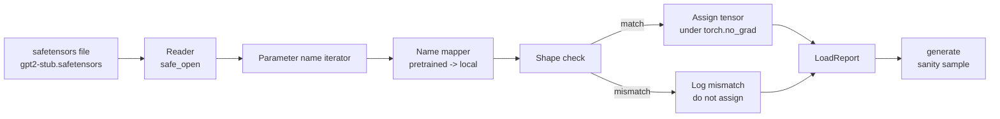

# Loading Pretrained Weights

> يعد تدريب نموذج مكون من 124 مليون معلمة من الصفر قرارًا يتعلق بالميزانية؛ تحميل نقطة تفتيش منشورة هو يوم الثلاثاء. يقوم هذا الدرس بتحميل أوزان النمط GPT-2 المُدربة مسبقًا من ملف أدوات الأمان إلى البنية الدقيقة من الدرس 35، ويسير في تعيين اسم المعلمة قطعة تلو الأخرى، ويولد التعقل استمرارًا لإثبات نجاح الحمل. لا توجد شبكة، ولا أدوات تحميل تابعة لجهات خارجية، ولا سحر غامض.

**النوع:** بناء
** اللغات: ** بايثون
**المتطلبات:** المرحلة 19 الدروس من 30 إلى 36
**الوقت:** ~90 دقيقة

## Learning Objectives

- اقرأ ملف أدوات الأمان في مكتبة `safetensors` Python وافحص أسماء وأشكال الموترات.
- قم بتعيين اسم كل معلمة تم تدريبها مسبقًا على معلمة داخل نموذج الدرس 35 GPT.
- التعامل مع اصطلاحي الأسماء اللذين يختلفان بين الأوزان المنشورة GPT-2 والنموذج في هذا المسار: `wte/wpe/h.N.attn.c_attn/c_proj` و `mlp.c_fc/c_proj` مقابل المسمى محليا `tok_embed/pos_embed/blocks.N.attn.qkv/out_proj` و `mlp.fc1/fc2`.
- اكتشاف ورفض عدم تطابق الشكل مع وجود خطأ واضح قبل إجراء أي عملية تعيين للوزن.
- أنشئ استمرارًا قصيرًا للأوزان المحملة وتأكد من أن الرموز المميزة تأتي من التوزيع المحمل، وليس التوزيع العشوائي.

## The Problem

لا يتم تجميع الأوزان المنشورة للهندسة المعمارية الخاصة بك. أنها تحمل الأسماء المستخدمة في التنفيذ الأصلي. يحتوي الملف الذي تم تدريبه مسبقًا على `transformer.h.0.attn.c_attn.weight` بالشكل `(2304, 768)`؛ يتوقع نموذجك `blocks.0.attn.qkv.weight` للشكل `(2304, 768)` (وهو نفس المصفوفة في اصطلاح تخطيط مختلف) أو يستخدم نموذجك `nn.Linear` الذي يخزن المصفوفة المنقولة. تظهر نفس المعلمة بثلاث هويات مختلفة تمامًا (الاسم والشكل وتخطيط البايت) ويجب على المُحمل التوفيق بين الثلاثة.

يقوم المُحمل الذي يقوم بالنسخ بشكل أعمى بوضع الموتر الصحيح في المكان الخطأ، وتحصل على نموذج يولد هراء. إن المُحمل الذي يرفض النسخ عندما يختلف الشكل ولكنه لا يسجل أي شيء يتركك تخمن أي موتر فشل في الهبوط. أداة التحميل في هذا الدرس واضحة: يتم تسجيل كل مهمة، ويتم فحص كل شكل، ويلخص `LoadReport` النتائج والإخفاقات وعدم تطابق الأشكال حتى تتمكن من قراءة ما حدث.

## The Concept



مخطط الاسم هو مجرد وظيفة من سلسلة إلى أخرى. التحقق من الشكل هو واحد إذا. تتم المهمة داخل `torch.no_grad()` لذا لا يقوم autograd بتتبع الحمل. التقرير يحمل نتيجة كل اسم.

### The GPT-2 naming convention

تم النشر GPT-2 أوزان حية تحت أسماء مثل:

| الاسم المتدرب | الشكل | معنى |
|-----------------|-------|--------|
| `wte.weight` | (50257، 768) | تضمين الرمز المميز |
| `wpe.weight` | (١٠٢٤، ٧٦٨) | تضمين الموقف |
| `h.N.ln_1.weight` | (768،) | مقياس LayerNorm 1 في الكتلة N |
| `h.N.ln_1.bias` | (768،) | تحول LayerNorm 1 عند الكتلة N |
| `h.N.attn.c_attn.weight` | (٧٦٨، ٢٣٠٤) | تنصهر QKV الوزن الخطي |
| `h.N.attn.c_attn.bias` | (٢٣٠٤،) | تنصهر QKV التحيز الخطي |
| `h.N.attn.c_proj.weight` | (٧٦٨، ٧٦٨) | إسقاط الاهتمام الناتج |
| `h.N.attn.c_proj.bias` | (768،) | الاهتمام الناتج الإسقاط التحيز |
| `h.N.ln_2.weight` | (768،) | مقياس LayerNorm 2 |
| `h.N.ln_2.bias` | (768،) | طبقة نورم 2 التحول |
| `h.N.mlp.c_fc.weight` | (768، 3072) | MLP وزن fc1 |
| `h.N.mlp.c_fc.bias` | (3072،) | MLP FC1 تحيز |
| `h.N.mlp.c_proj.weight` | (3072، 768) | MLP وزن fc2 |
| `h.N.mlp.c_proj.bias` | (768،) | MLP تحيز FC2 |
| `ln_f.weight` | (768،) | مقياس LayerNorm النهائي |
| `ln_f.bias` | (768،) | إزاحة الطبقة النهائية |

مفاجأتان للتخطيط لهما. يتم تخزين الخطوط `c_attn`، `c_proj`، `c_fc` مع المصفوفة المنقولة بالنسبة لما يتوقعه `nn.Linear.weight`. ينقل المحمل أثناء المهمة. الرأس LM غير موجود في الملف على الإطلاق؛ يعتمد النموذج على ربط الوزن بـ `wte`، لذلك يتم ضبط الرأس عن طريق الاسم المستعار مرة واحدة `wte`.

### The local naming convention

يستخدم النموذج في هذا المسار أسماء وصفية:

| الاسم المحلي | معنى |
|------------|---------|
| `tok_embed.weight` | تضمين الرمز المميز |
| `pos_embed.weight` | تضمين الموقف |
| `blocks.N.ln1.scale` | مقياس LayerNorm 1 في الكتلة N |
| `blocks.N.ln1.shift` | طبقة نورم 1 التحول |
| `blocks.N.attn.qkv.weight` | منصهر QKV |
| `blocks.N.attn.qkv.bias` | تنصهر QKV التحيز |
| `blocks.N.attn.out_proj.weight` | إسقاط الاهتمام الناتج |
| `blocks.N.attn.out_proj.bias` | انحياز إسقاط الإخراج |
| `blocks.N.ln2.scale` | مقياس LayerNorm 2 |
| `blocks.N.ln2.shift` | طبقة نورم 2 التحول |
| `blocks.N.mlp.fc1.weight` | MLP FC1 |
| `blocks.N.mlp.fc1.bias` | MLP FC1 تحيز |
| `blocks.N.mlp.fc2.weight` | MLP FC2 |
| `blocks.N.mlp.fc2.bias` | MLP تحيز FC2 |
| `final_ln.scale` | مقياس LayerNorm النهائي |
| `final_ln.shift` | إزاحة الطبقة النهائية |

التعيين هو وظيفة ثابتة. يرسله الدرس على شكل إملاء يكرره المُحمل.

### The stub fixture

حقيقي GPT-2 الأوزان 0.5 GB. لا يقوم العرض التوضيحي بتنزيلها؛ إنه ينشئ أداة تثبيت صغيرة لأدوات الأمان عند التشغيل الأول، مع اصطلاح التسمية GPT-2 الدقيق والأشكال المناسبة لنموذج مكون من 12 قطعة في d_model 192 بدلاً من 768. تحتوي الوحدة على البنية الصحيحة لممارسة كل مسار كود في المُحمل. استبدل التركيب بالملف الحقيقي وسيعمل اللودر بدون تعديل.

## Build It

`code/main.py` ينفذ:

- نسخة طبق الأصل صغيرة من الدرس 35 `GPTModel` لذا فإن هذا الدرس مستقل بذاته.
- `make_pretrained_to_local(num_layers)` الذي يعمل على توسيع الإدخالات لكل طبقة.
- `load_safetensors(model, path)` الذي يكرر الأسماء، ويعينها، ويتحقق من الشكل، وينقل أوزان نمط conv1d، ويعين ضمن `torch.no_grad()`. إرجاع `LoadReport`.
- `make_stub_safetensors(path, cfg)` الذي يُنشئ ملفًا ثابتًا باستخدام اصطلاح التسمية المُدرب مسبقًا.
- عرض توضيحي ينشئ `outputs/gpt2-stub.safetensors` عند التشغيل لأول مرة، ويبني نموذجًا جديدًا، ويلتقط استمرارًا واحدًا تم إنشاؤه من الحرف الأول العشوائي، ويحمل كعب الروتين، ويلتقط استمرارًا آخر، ويطبع كليهما، ويتحقق من اختلاف الاثنين (لقد غيّر التحميل النموذج بالفعل).

تشغيله:

```bash
python3 code/main.py
```

الإخراج: مسار التثبيت، وسجل التحميل لكل اسم، وملخص `LoadReport`، واستمرار قبل التحميل، واستمرار بعد التحميل، وعدم تطابق الشكل على موتر واحد سيئ عمدًا تم حقنه في التثبيت بحيث يتم ممارسة مسار الفشل.

## Stack

- `safetensors` لتنسيق القرص وقارئ البث.
- `torch` للنموذج والرياضيات الواجبة.
- لا `transformers`، لا `huggingface_hub`، لا توجد مكالمات عبر الشبكة.

## Production patterns in the wild

ثلاثة أنماط make المحمل تنجو من ملامسة الأوزان التي لم تقم بإنشائها.

**تحقق دائمًا من صحة الملف قبل أي مهمة.** افتح الملف، وأدرج كل اسم موتر مع نوعه وشكله، وقم بتشغيل التعيين الكامل مع عمليات التحقق من الشكل، وفقط عند النجاح، ابدأ التعيين. النماذج نصف المحملة هي آلات فشل صامتة.

**سجل كل مهمة باستخدام اسم المصدر واسم الوجهة.** عندما يبدو شيء ما خاطئًا، يخبرك السجل بالمكان الذي هبط فيه الموتر؛ البديل هو قراءة hexdumps. تقوم فئة البيانات `LoadReport` في هذا الدرس بتتبع `loaded` و`missing` و`unexpected` و`shape_mismatch` وتطبع ملخصًا في النهاية.

**الرأس LM هو اسم مستعار لربط الوزن، وليس نسخة منفصلة.** الإعداد `model.lm_head.weight = model.tok_embed.weight` بعد التحميل `tok_embed` هو النمط المتعارف عليه. يؤدي نسخ مصفوفة التضمين إلى معلمة `lm_head.weight` جديدة إلى قطع الارتباط ومضاعفة عدد المعلمات بهدوء.

## Use It

- يعمل المُحمل مع أي ملف آمن يستخدم اصطلاح التسمية المُدرب مسبقًا. حقيقي GPT-2 ملفات (صغيرة/متوسطة/كبيرة/xl) تعمل بدون تغييرات في التعليمات البرمجية؛ يختلف تكوين النموذج فقط.
- يمتد نفس النمط إلى أوزان LLaMA وMistral وQwen بمجرد تحديث خريطة الاسم. تظل عمليات فحص الشكل والتقرير متطابقتين.
- توليد التعقل بعد التحميل هو بوابة سريعة: إذا كانت عينات ما بعد التحميل تبدو مثل عينات ما قبل التحميل، فإن الحمل لم يغير النموذج، مما يعني أن التعيين غاب عن كل موتر بصمت.

## Exercises

1. أضف وسيطة `dtype` إلى المُحمل الذي يلقي كل موتر إلى نوع dtype مستهدف (`bfloat16`، `float16`، `float32`) أثناء المهمة. تأكد من إمكانية تحويل النموذج `float32` إلى `bfloat16` وما زال يتم إنشاؤه.
2. أضف الوسيطة `expected_layers` التي ترفض تحميل نقطة التحقق التي لا تتطابق فهارسها `h.N` مع `num_layers` الخاصة بالنموذج.
3. قم بتوصيل المُحمل بوظيفة توليد الدرس 35 وقم بإنتاج عينتين جنبًا إلى جنب: واحدة من init العشوائي، وواحدة من التركيبات المحملة.
4. أضف مسار تصدير: اكتب حالة النموذج الحالية في ملف أدوات الأمان الجديد باستخدام اصطلاح التسمية المُدرب مسبقًا. قم بزيارة المُحمل ذهابًا وإيابًا وتأكد من أن التقرير لا يحتوي على أي حالات عدم تطابق في الشكل.
5. قم بتوسيع `NAME_MAP` للتعامل مع اصطلاح تسمية LLaMA (بدون تحيزات، RMSNorm، تخطيط qkv مدمج) وأعد تشغيل أداة التحميل على أداة تثبيت LLaMA التي قمت بإنشائها.

## Key Terms

| مصطلح | ماذا يقول الناس | ماذا يعني في الواقع |
|------|-|---------------------------------------|
| خريطة الاسم | "إعادة تعيين المفتاح" | الوظيفة من أسماء الموتر المدربة مسبقًا إلى أسماء المعلمات المحلية؛ عادة ما يكون الإملاء الحرفي مع إدخال واحد لكل فهرس طبقة موسع عبر حلقة |
| عدم تطابق الشكل | "شكل سيء" | يوجد الموتر المُدرب مسبقًا تحت الاسم المعين ولكن أبعاده لا تتوافق مع المعلمة المحلية؛ يرفض المُحمل التعيين ويسجل الزوج |
| تبديل عند التحميل | "تخطيط Conv1d" | تم نشر GPT-2 اهتمامًا بالمخازن وMLP إسقاطات في تبديل ما تتوقعه nn.Linear؛ ينقل المحمل أثناء المهمة |
| الاسم المستعار لربط الوزن | "رأس LM مشترك" | تعيين model.lm_head.weight = model.tok_embed.weight بحيث يتشارك الرأس والتضمين في التخزين؛ الرأس ليس في الملف بسبب هذا |
| تحميل التقرير | "ملخص التغطية" | فئة بيانات صغيرة تتعقب القوائم المحملة، والمفقودة، وغير المتوقعة، وغير المتطابقة الشكل؛ الطباعة هي الطريقة التي يمكنك بها معرفة ما إذا كان التحميل قد نجح |

## Further Reading

- المرحلة 19 الدرس 35 للعمارة التي تستقبل الأوزان.
- المرحلة 19 الدرس 36 للحلقة التدريبية التي تنتج نقطة تفتيش بنفس الشكل.
- المرحلة 10 الدرس 11 (التكميم) لما يجب فعله بالأوزان المحملة عند ضيق الذاكرة.
- المرحلة 10 الدرس 13 (بناء خط كامل LLM pipe) لدورة الحياة الكاملة حول التحميل والاستدلال.
